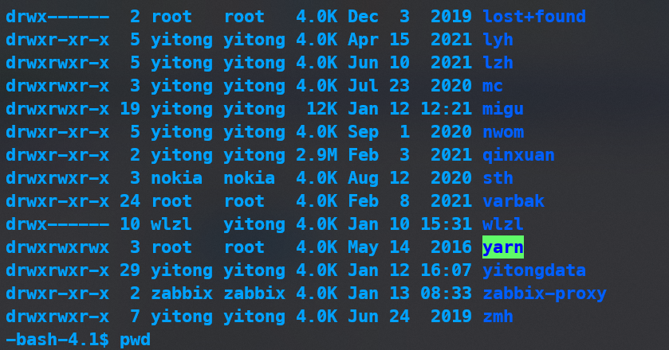

# Windows Terminal免密码登录Linux系统
服务器端要生成关键的三个文件，权限设置要正确
```Linux
[nokia@hadoop22 .ssh]$ ll
total 16
-rw------- 1 nokia nokia  970 Oct  7 20:59 authorized_keys
-rw------- 1 nokia nokia 1675 Mar 30  2021 id_rsa
-rw-r--r-- 1 nokia nokia  403 Mar 30  2021 id_rsa.pub
-rw-r--r-- 1 nokia nokia 2545 Jun  4 11:45 known_hosts
```

有时候上面配置正确仍不能免密码登录，需要检查用户家目录是否权限正确。

比如上面yidongdata的权限就不对，需要修改为0700
```linux
chmod 0700 yitongdata
```