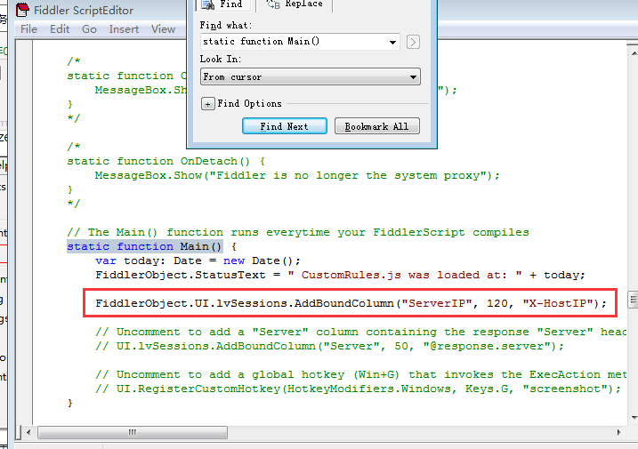

# fiddler抓包显示服务器IP地址
1.菜单->Rules->Customize Rules

2.在CustomRules.js文件里Ctrl+F查找字符串 static function Main()后添加一行FiddlerObject.UI.lvSessions.AddBoundColumn("ServerIP", 120, "X-HostIP");

代码后，重启fiddler之后就可见Server IP了 （显示在最后面）

