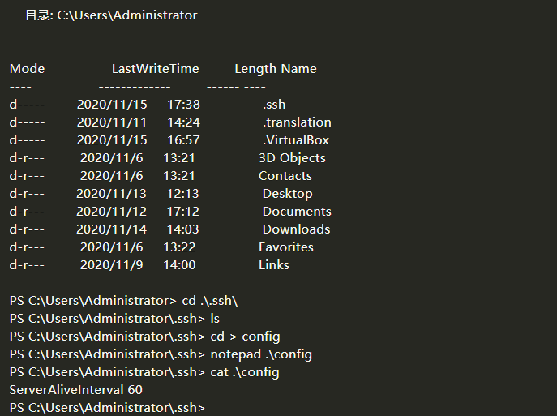

# windows terminal ssh连接服务器反空闲
1. 打开 window Terminal 或 cmd 进去用户家目录
2. 家目录下面有通过ssh命令连接过的记录 .ssh文件夹（如果没有 选择查看->勾选隐藏的项目）
3. 进去.ssh目录
4. 新建 config 文件（不要有任何后缀）
5. 输入 ServerAliveInterval 60 （表示间隔60秒发送一次数据）并保存
