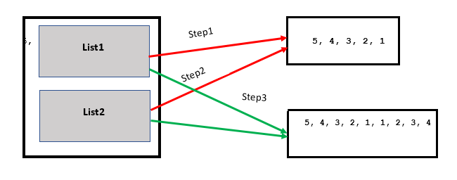
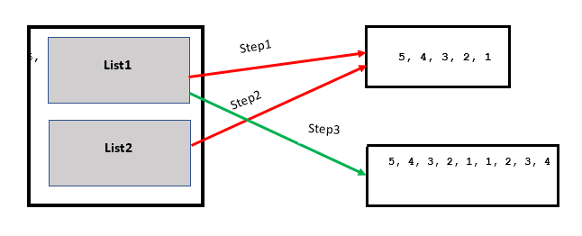

# a += b 和a = a + b的区别
Python中a += b不总是和a = a + b的结果一样。在不同的条件下，相同的操作数可能给出不同的结果。
## 创建新变量
```python
a = 10
print(" id of a : ", id(10) ," Value : ", a )
```
Output :

```text
id of a :  11094592  Value :  10
```
在上面的示例中，整数10存储在内存中，其引用被分配给变量a。

## 修改变量
```python
a = 10 # 将值分配给变量创建新对象
print(" id of a : ", id(a) ," Value : ", a )

a = a + 10 # 变量的修改值会创建新对象
print(" id of a : ", id(a) ," Value : ", a )

a += 10 # 变量的修改值会创建新对象
print(" id of a : ", id(a) ," Value : ", a )
```
Output : 

```text
id of a :  11094592  Value :  10
id of a :  11094912  Value :  20
id of a :  11095232  Value :  30
```
每当我们创建或修改int、float、char、string时，它们都会创建新对象，并将新创建的引用分配给各自的变量。
但是相同的操作在列表上会有不同的效果。
```python
a = [0, 1] # 列表存储在内存中，将列表的引用赋给变量a
print("id of a: ",id(a) , "Value : ", a )

a = a + [2, 3] # 这也将在内存中存储相同的数据，并将引用分配给变量
print("id of a: ",id(a) , "Value : ", a )

a += [4, 5]
print("id of a: ",id(a) , "Value : ", a )


```
 Output: 

```text
id of a:  140266311673864 Value :  [0, 1]
id of a:  140266311673608 Value :  [0, 1, 2, 3]
id of a:  140266311673608 Value :  [0, 1, 2, 3, 4, 5]  
```
此处你可以看到为什么a = a + b 的结果有时和a += b的结果不一样。
列表操作举例：
Example 1: 

```python
list1 = [5, 4, 3, 2, 1]
list2 = list1
list1 += [1, 2, 3, 4] # 在当前的引用上修改值

print(list1)
print(list2)
```
Output: 

```text
[5, 4, 3, 2, 1, 1, 2, 3, 4]
[5, 4, 3, 2, 1, 1, 2, 3, 4]
```

Example 2 

```python
list1 = [5, 4, 3, 2, 1]
list2 = list1
list1 = list1 + [1, 2, 3, 4]

print(list1)
print(list2)
```
Output: 
```text
[5, 4, 3, 2, 1, 1, 2, 3, 4]
[5, 4, 3, 2, 1]
```

表达式list1 += [1, 2, 3, 4]  是在原地修改列表的值，这意味着引申出来的列表list1和list2仍然有相同的引用，指向相同的list。
表达式list1 = list1 + [1, 2, 3, 4] 创建了一个新的列表，list1指向了新的列表，而list2仍然指向老的列表。
