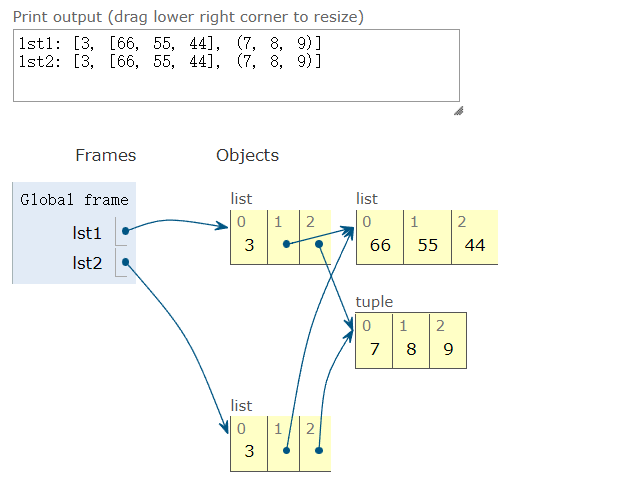
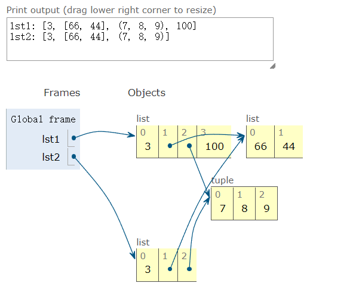
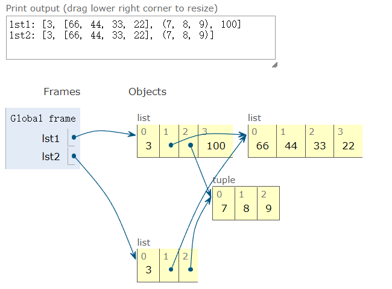
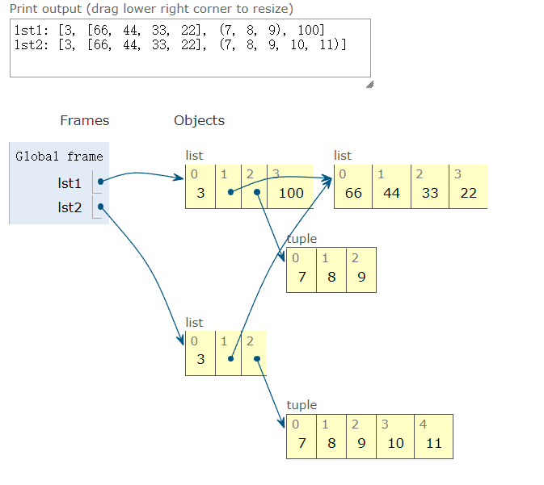

# 浅拷贝和深拷贝
## 浅拷贝
拷贝列表（或多数内置的可变集合）最简单的方式是使用内置的类型构造方法。例如：
```python
>>> lst1 = [3, [55, 44], (7, 8, 9)]
>>> lst2 = list(lst1) # 此处也可以使用lst2 = lst1.copy() 来创建lst1的副本
>>> lst2
[3, [55, 44], (7, 8, 9)]
>>> lst2 == lst1 # 副本和源列表相等
True
>>> lst2 is lst1 # 但是二者指代不同的对象
False
```
对列表和其他可变序列来说，还能使用简洁的 lst2 = lst1[:] 语句创建副本。
然而，构造方法或 [:] 做的是浅拷贝（即拷贝了最外层容器，副本中的元素是源容器中元素的引用）。如果所有元素都是不可变的，那么这样没有问题，还能节省内存。但是，如果有可变的元素，可能就会导致意想不到的问题。
下面通过分步演示浅拷贝每一步操作对源列表和副本列表的影响。生成动态演示结果的网址：https://pythontutor.com/
```python
>>> lst1 = [3, [66, 55, 44], (7, 8, 9)]
>>> lst2 = list(lst1)
```

通过浅拷贝操作，生成的lst2和lst1结果相同。
```python
>>> lst1.append(100)
>>> lst1[1].remove(55)
```

把 100 追加到 lst1 中，对 lst2 没有影响。把内部列表 lst1[1] 中的 55 删除。这对 lst2 有影响，因为 lst2[1] 绑定的列表与 lst1[1] 是同一个。
```python
lst2[1] += [33,22]
```


<font color=red>对可变的对象来说</font>，如 lst2[1] 引用的列表，+= 运算符就地修改列表。这次修改在 lst1[1] 中也有体现，因为它是 lst2[1] 的别名。
```python
lst2[2] += (10,11)
```

<font color=red>对元组来说(不可变对象)</font>，+= 运算符创建一个新元组，然后重新绑定给变量lst2[2]。这等同于 lst2[2]= lst2[2] + (10, 11)。现在，lst1 和 lst2 中最后位置上的元组不是同一个对象。
由以上演示可知浅拷贝容易操作，但是得到的结果可能并不是你想要的。
## 为任意对象做深拷贝和浅拷贝
有时候我们需要对对象进行深拷贝（即副本不共享内部对象的引用）。copy模块提供的deepcopy和copy函数能为任意对象做深拷贝和浅拷贝。
为演示copy()和deepcopy()的用法，我们定义一个简单的类，Bus，这个类标识运载乘客的小车，在途中乘客会上车或下车。
```python
class Bus:

    def __init__(self, passengers=None):
        if passengers is None:
            self.passengers = []
        else:
            self.passengers = list(passengers)

    def pick(self, name):
        self.passengers.append(name)

    def frop(self, name):
        self.passengers.remove(name)
```
接下来，在交互式控制台中我们将创建一个Bus示例（bus1）和两个副本，一个是浅拷贝副本（bus2），另一个是深拷贝副本（bus3），看看在bus1有学生下车后会发生什么。

```python
import copy
bus1 = Bus(['张三','李四','王五','赵六'])
bus2 = copy.copy(bus1)
bus3 = copy.deepcopy(bus1)
id(bus1), id(bus2), id(bus3) # 使用 copy 和 deepcopy，创建 3 个不同的 Bus 实例。
Out[8]: (1480394493088, 1480394492800, 1480394492416)
bus1.drop('张三')
bus2.passengers
Out[9]: ['李四', '王五', '赵六'] # bus1 中的 '张三' 下车后，bus2 中也没有他了。
id(bus1.passengers), id(bus2.passengers), id(bus3.passengers)
Out[10]: (1480394208000, 1480394208000, 1480394431360) # 审查 passengers 属性后发现，bus1 和 bus2 共享同一个列表对象，因为 bus2 是 bus1 的浅复制副本
bus3.passengers
Out[11]: ['张三', '李四', '王五', '赵六'] # bus3 是 bus1 的深复制副本，因此它的passengers 属性指代另一个列表。
```
注意，一般来说，深复制不是件简单的事。如果对象有循环引用，那么这个朴素的算法会进入无限循环。deepcopy 函数会记住已经复制的对象，因此能优雅地处理循环引用。

### 循环引用
b 引用 a，然后追加到 a 中；deepcopy 会想办法复制 a。
```python
In [1]: a = [10, 20]

In [2]: b = [a, 30]

In [3]: a.append(b)

In [4]: a
Out[4]: [10, 20, [[...], 30]]

In [5]: from copy import deepcopy

In [6]: c = deepcopy(a)

In [7]: c
Out[7]: [10, 20, [[...], 30]]
```
此外，深复制有时可能太深了。例如，对象可能会引用不该复制的外部资源或单例值。我们可以实现特殊方法 \_\_copy__() 和\_\_deepcopy__()，控制 copy 和 deepcopy 的行为。