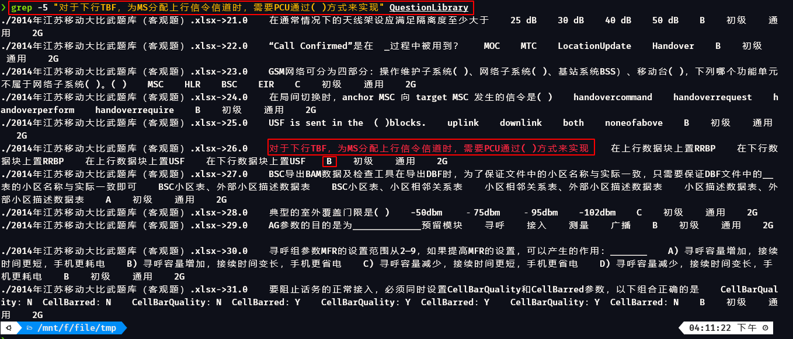

# 工具使用说明

该工具目前集成了did、cfc、fa三个命令。下面为三个命令的详细介绍

## did

### 功能介绍

实现csv文件入库PostgreSQL数据库时自动生成入库语句。

### 特色功能

使用过程中不需要关心待入库文件的编码格式，程序会自动识别编码格式，并生成对应编码格式的入库语句。

### 注意事项

生成的SQL入库语句每列的数据类型均采用文本方式，不对类型进行猜测。如需对字段类型进行转换，可在入库后使用sql语句转换成自己需要的类型。

### 使用方法

1. 查看帮助信息

命令行界面输入did -h查看工具帮助信息

```
usage: postgresql入库工具 [-h] -t TABLENAME -f FILENAME [-v]

postgresql入库工具

optional arguments:
  -h, --help            show this help message and exit
  -t TABLENAME, --tablename TABLENAME
                        需要建的表名
  -f FILENAME, --filename FILENAME
                        待入库的文件名
  -v, --version         版本信息
```

2. 参数说明

-t 表示需要创建的表名， -f 表示需要入库的csv文件名

3. 使用举例

```sql
❯ did -f example.csv -t example
------------------------------------------------------------------------------------------
CREATE TABLE example
(
City text,
State text,
Population text,
Latitude text,
Longitude text
);
COPY example FROM '/home/qinxuan/python_tool/example.csv' DELIMITER ',' CSV HEADER ENCODING 'UTF-8';
------------------------------------------------------------------------------------------
```

## cfc

### 功能介绍
查看文件编码格式
### 特色功能
可批量查看文件编码，可在多级目录中递归查看文件编码
### 注意事项
只可以对普通文件进行查看文件编码，不能对xlsx、pdf ……查看编码，当有上述类型文件时，返回的信息为None，例如：
```linux
❯ cfc test.xlsx
test.xlsx
{'encoding': None, 'confidence': None}
```
### 使用方法
1. 查看帮助

命令行界面输入cfc -h查看工具帮助信息

```linux
❯ cfc -h
usage: cfc [-h] [-r] [-v] [file [file ...]]

positional arguments:
  file           待判断编码的文件名

optional arguments:
  -h, --help     show this help message and exit
  -r             对目录进行递归查询文件编码
  -v, --version  版本信息
```
2. 参数说明

-r 表示对当前目录下的子目录进行递归查询

3. 使用举例

直接在终端输入cfc 命令，后面跟上要查询编码的文件，例如：
```linux
❯ cfc test.csv
test.csv
{'encoding': 'GB18030', 'confidence': 0.9900000095367432}
```
下面展示了对当前目录的文件进行编码查询和对子目录下文件的递归查询。

当前文件下的文件、目录信息如下，其中test.txt问文件，两外两个为目录
```linux
❯ ls
bdist.linux-x86_64  lib  test.txt
```
直接输入cfc * 只查出来test.txt文件的编码信息
```linux
❯ cfc *
test.txt
{'encoding': 'UTF-8', 'confidence': 0.9900000095367432}
```

输入cfc * -r 可以查出当前路径下文件和子目录下所有文件的编码信息
```Linux
❯ cfc * -r
lib/src/__main__.py
{'encoding': 'ASCII', 'confidence': 1.0}
lib/src/checkfilecode.py
{'encoding': 'UTF-8', 'confidence': 0.9900000095367432}
lib/src/findanswer.py
{'encoding': 'UTF-8-SIG', 'confidence': 0.9900000095367432}
lib/src/dataintodatabase.py
{'encoding': 'UTF-8', 'confidence': 0.9900000095367432}
lib/src/__init__.py
{'encoding': None, 'confidence': None}
test.txt
{'encoding': 'UTF-8', 'confidence': 0.9900000095367432}
```

## fa

### 功能介绍

该功能主要是应付在线考试查答案

### 特色功能

以往查答案如果题库过多，在excel中搜索跨多个excel文件的话无法一次搜索完，导致查答案效率地下。
该命令可以将指定路径下的xls xlsx csv 文件的题库合并写入到一个文件中，在如文件中时在每行的开头追加上该条内容是来自于哪条题库的。
即使xls  xlsx 文件中有多个sheet，该命令依然可以正常工作。
csv 文件无需事先知道编码格式，读取时候会自动识别编码格式，确保成功读取所有类型试题。

### 注意事项

该命令未考虑word类型的题库，因为word类型可以手动粘贴到excel中，在使用本工具进行合并，因此就未增加word类型题库的解析函数。

### 使用方法

1. 查看帮助

命令行界面输入fa -h查看工具帮助信息
```linux
❯ fa -h
usage: 网优试题题库处理 [-h] [-p filepath [filepath ...]] [-s SAVE] [-v]

网优试题题库处理

optional arguments:
  -h, --help            show this help message and exit
  -p filepath [filepath ...], --path filepath [filepath ...]
                        初始化题库信息
  -s SAVE, --save SAVE  初始化后题库保存位置
  -v, --version         版本信息
```

2. 参数说明
参数 -p 为题库所在路径的目录

参数 -s 为合并后题库文件存放的目录

3. 用法举例

例如当前目录下有三个题库文件
```linux
❯ ls
2014年江苏移动大比武题库（客观题）.xlsx  5G题库3.xlsx  中国移动网上大学_答案.csv
```
-p 参数跟题库所在的路径，可使用相对路径和绝对路径
-s 参数跟生成结果要保存的路径，可使用相对路径和绝对路径
注意：-s参数也可以不写，如果不写生成的结果默认保存在执行fa命令的当前路径下
```linux
❯ fa -p ./ -s /mnt/f/
./2014年江苏移动大比武题库（客观题）.xlsx
正在初始化->./2014年江苏移动大比武题库（客观题）.xlsx<-题库,请等待...
正在初始化->./2014年江苏移动大比武题库（客观题）.xlsx<-题库,请等待...
正在初始化->./2014年江苏移动大比武题库（客观题）.xlsx<-题库,请等待...
./5G题库3.xlsx
正在初始化->./5G题库3.xlsx<-题库,请等待...
正在初始化->./中国移动网上大学_答案.csv<-题库,请等待...
题库初始化完毕
```
文件生成后可直接使用搜索命令对题库内容进行搜索，
因为python为动态解释型语言，通过python实现搜索功能的话随着题库文件的增大，效率大大降低，因此推荐在linux系统下推荐使用grep命令，在windows系统下推荐先自行安装grep命令后在使用。

下面进行简单的搜索演示
linux---grep

-5 参数表示搜索到目标内容后，显示目标行所在的上下5行信息，这样可以避免有些题库选项是竖着排列的，只显示一行的话，看不到选项信息。


以上搜索结果会高亮显示，且速度快，理论上只要题库积攒的够多，考试考过的可能性就更大，不再受限与查找速度慢，查找不过来的情况。