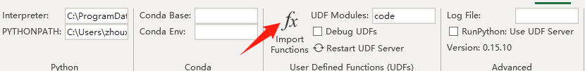
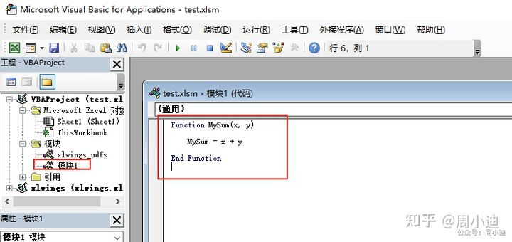

# xlwings
## 环境搭建
### 安装xlwings包
```cmd
pip install xlwings
```
### 配置Excel环境
#### 添加“开发工具”选项卡
关于VBA的一些功能设置是在“开发工具”选项卡中的，但是Excel默认是不显示这个选项卡的，需要我们手动添加
添加方式：打开Excel - 文件 - 选项 - 自定义功能区 - 勾选“开发工具” - 确定
如下图所所示：

设置完成后，在菜单栏中就可以看到了：


#### 启用宏
接着，我们来启用宏，点击“开发工具”菜单中的宏安全性，勾选“启用所有宏”和“信任对VBA工程对象模型的访问”这两个选项，然后点击确认
如下图所示：

#### 安装xlwings加载项
我们还需要将xlwings相关功能加载到Excel中，在命令行中输入

```cmd
xlwings addin install
```
然后重新打开Excel文件，就可以发现Excel里面包含xlwings选项卡了


最后，我们还需要到VBA中勾选xlwings的支持：开发工具 - 查看代码 - 工具 - 引用 - 勾选“xlwings” - 确定


#### 配置解释器路径

到目前为止，我们已经配置好了Python环境，也将xlwings加载到了Excel中，那么最后一步，就是将两者关联起来，配置一下解释器路径。就是上图的interpreter方框和PYTHONPATH方框。

interpreter填的是python.exe的路径，我的是c:\users\zxd\anaconda3\python.exe（如果你按照我的教程一步步来设置的，应该也是这个路径。其中，zxd是你的用户名，这个会根据实际情况变化）

然后PYTHONPATH填的是要运行的py代码文件所在的文件夹路径。你使用哪个文件夹存放你的python代码文件，就填写那个文件夹路径，例如我随便存放在了C:\Users\ZXD\Documents这个目录下

最好把py文件都集中存放在统一目录下，方便管理和调用


最后，我们再看UDF Modules那个方框，那里面填写的是此工作簿要调用的python代码文件名称，不需要带上后缀名，比如我要调用code.py这个文件，便在框中填写code即可（当然，目前为止我们还没有编写python代码，所以这里可以先空着）。

OK，经过以上的设置，整个交互环境就被我们搭建成功了！

在进入实战之前，要声明一点，虽然本篇有较多的篇幅来讲述如何使用Excel调用Python脚本，但是这个功能在实际工作中的应用场景极其有限，建议大家了解即可。
对于xlwings的学习和使用，我们应该把更多的精力放在如何通过Python操作Excel上（后续篇章会着重介绍），这才是我们实现办公自动化的方式。
## Excel调用Python脚本
1. 无返回值的函数
新建一个txt文档并打开，然后复制下面的代码进去

```python
import numpy as np
import xlwings as xw

def world():
    wb = xw.Book.caller()
    wb.sheets[0].range('A1').value = 'Hello World!'
```
这段代码的含义是：在当前Excel文件的第一个工作表A1单元格输入Hello World!

然后将文件另存为code.py，保存在与Excel文件相同的目录下

:::info 新建py文件的方式有很多种，对于使用Python编辑器的同学来说，通过编辑器创建更加方便。 :::
首先，我们打开VBA编辑器的，输入以下代码：

```vba
Sub HelloWorld()
    RunPython ("import code; code.world()")
End Sub
```
这段代码的含义是：调用code.py脚本中的world函数
最后，按下F5运行程序
2. 有返回值的函数
```python
import os
import xlwings as xw

@xw.func
def cwf():
    return os.getcwd()
```
上面这段代码含义：获取py文件所在的文件夹路径。

首先在UDF Modules方框里输入code，表明我们要调用的文件名，然后点下图箭头所指Import Functions按钮（这个过程可能会弹出一个黑色窗口，我们不用理它）

然后，在任意单元格输入=cwf() 即可调用code文件里cwf函数，结果返回当前文件路径，如下图所示


## Python中调用VBA脚本
整个过程非常简单，只需要两步即可，首先我们先编写VBA代码，然后在Python中调用就可以了

打开VBA代码编辑器，新建一个模块（插入 - 模块），然后输入以下代码
```vba
Function MySum(x, y)
    MySum = x + y
End Function
```
如图所示，然后将Excel保存关闭，注意要保存为xlsm格式


在Python编译器中输入以下代码，然后运行

```python
import xlwings as xw

app = xw.App(visible=True,add_book=False)

'设置测试文件的路径
wb = app.books.open(r'C:/Users/zhoux/Desktop/test.xlsm')

'调用VBA脚本
my_sum = wb.macro('MySum')

my_sum(1, 2)
```
Python与Excel的交互到此为止就介绍完了，其实到目前为止，我们介绍的这些功能都是“小菜”，大家了解即可，真正的“硬菜”是使用xlwings来实现Python对Excel的全面操控。这部分教程我们会在后面的篇章继续介绍。


