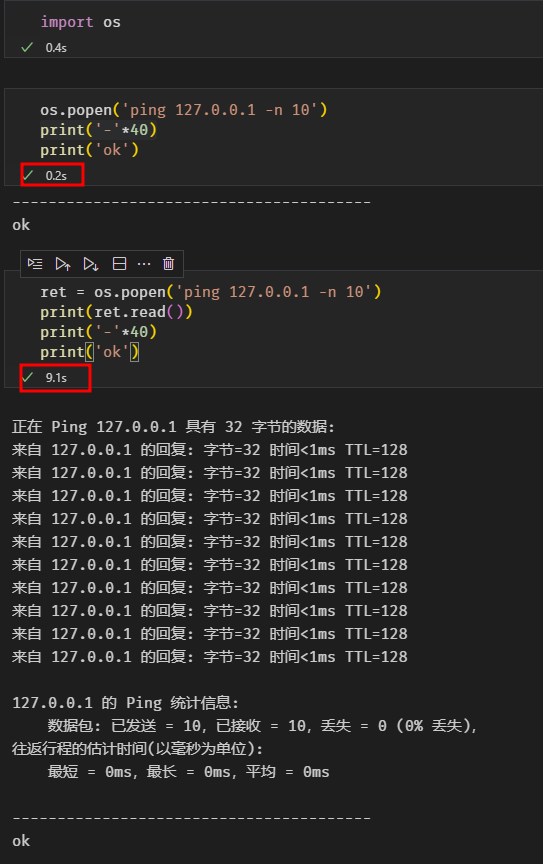

# os.popen的非阻塞和完全阻塞
## os.popen的作用
在使用Python调用系统的命令行命令时（如调用cmd的ping、dir……）可以使用os.popen函数，但这个函数在使用的时候稍不留神会有一个大坑……

## 场景模拟

在写Python代码时，有一下的使用场景，需要用Python调用一个命令行工具（该命令行工具不是系统自带的，作用是对一个二进制文件转换为csv文件）
```python
def bin2csv(binFile):
    '''
    对bin文件进行自动转换
    '''
    filename = os.path.basename(binFile)
    os.popen('DDR4Convert {inputfile} {outputfile}'.format(inputfile=binFile,outputfile=outputdir_abs+ "/" + filename.split('.')[0]+".csv"))
```
调用上面函数后，紧接着执行对转换后的outputfile进行操作，但Python总会报错，提示没有该文件。
针对这个错误进行各种检查，都无法解决该问题，后来经过网上查找资料才明白，上面的Python代码对os.popen的使用方式是非阻塞的，意思就是在调用系统的cmd命令后Python代码不会等待bin文件转csv文件完成就执行后续的Python代码了，这就导致后续对csv文件操作的代码会提示没有该文件。

## 解决方案

```python
def bin2csv(binFile):
    '''
    对bin文件进行自动转换
    '''
    filename = os.path.basename(binFile)
    ret = os.popen('DDR4Convert {inputfile} {outputfile}'.format(inputfile=binFile,outputfile=outputdir_abs+ "/" + filename.split('.')[0]+".csv"))
    ret.readlines()
```
使用一个变量对os.popen函数执行的结果进行接收，然后打印出来，这种情况下os.popen的使用方式就变成完全阻塞的了，意思就是在调用系统的cmd命令后Python代码会等待bin文件转csv文件完成后才会执行后续Python代码。

## ping命令示例

第一种为非阻塞方式，0.2秒就执行完毕了，其实此时ping命令还没有结束。
第二种为完全阻塞方式耗时9.1秒执行完毕，最后的print ok 会等待ping 10次结束后在打印出来。