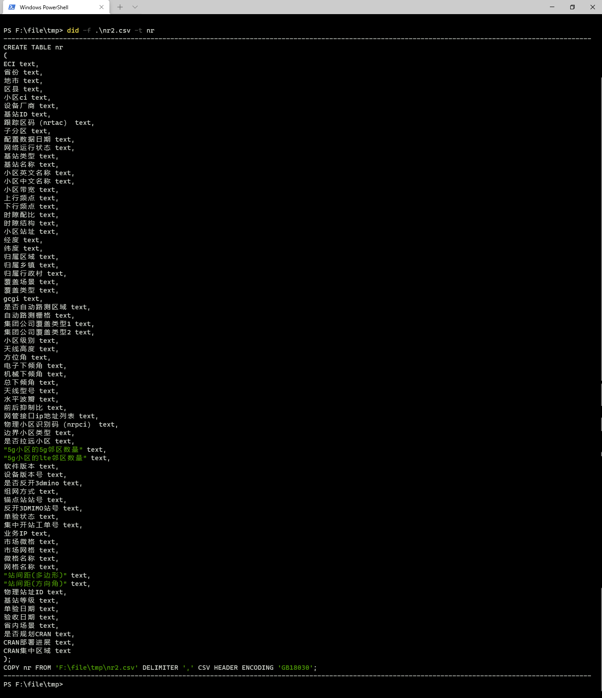

# python工具集--d2u命令
日常工作中当对csv文件进行入库(PostgreSQL数据库)操作时，有时会遇到下方错误提示：
```sql
qx=# COPY nr_test FROM 'F:\file\tmp\nr.csv' DELIMITER ',' CSV HEADER ENCODING 'GB18030';
错误:  在数据中找到了未用引号引起来的新行
提示:  使用用引号因起来的CSV字段来表示新行.
背景:  COPY nr_test, 行 2
```
产生以上错误的原因是待入库的文件--nr.csv的换行符为\r\n

windows、unix、mac系统的换行符是不同的，Unix下一般只有一个 0x0A 表示换行（"\n"），Windows 下一般都是 0x0D 和 0x0A 两个字符，即 0D0A（"\r\n"），苹果机（MAC OS系统）则采用回车符 CR 表示下一行（"\r"）。

Unix 系统中：每行结尾只有 "<换行>"，即 "\n"；

Windows 系统中：每行结尾是 "<回车><换行>"，即 "\r\n"；

Mac 系统中：每行结尾是 "<回车>"，即 "\r"。

而PostgreSQL数据库在对文件进行入库时，它只识别unix的换行符（“\n”）而对于大部分使用windows系统生成的文件，入库时候就会报上面的错误。

怎么解决这个问题呢，可以使用python工具集中的d2u命令，该命令可以将文档中的windows换行符（“\r\n”）替换为unix系统的换行符（“\n”）。替换后在入库就不会报错了。

## d2u命令使用说明
d2u命令是用python写的一个命令行工具，直接输入d2u回车会显示命令行的使用简介
```powershell
PS F:\file\tmp> d2u
usage: 换行符转换 [-h] -o ORGINFILE -t TARGETFILE [-v]
换行符转换: error: the following arguments are required: -o/--orginfile, -t/--targetfile
```
输入d2u -h可以显示帮助信息
```powershell
PS F:\file\tmp> d2u -h
usage: 换行符转换 [-h] -o ORGINFILE -t TARGETFILE [-v]

换行符转换

optional arguments:
  -h, --help            show this help message and exit
  -o ORGINFILE, --orginfile ORGINFILE
                        原始文件
  -t TARGETFILE, --targetfile TARGETFILE
                        目标文件
  -v, --version         版本信息
```

输入d2u -v 可显示版本信息
```powershell
PS F:\file\tmp> d2u -v
换行符转换 0.0.1
```
### 关键参数说明
```powershell
PS F:\file\tmp> d2u -o .\nr.csv -t nr2.csv
```
-o ：原始的输入文件， -t：转换后要保存的目标文件
执行上述命令后，nr2.csv文件就是转换换行符后的文件。


转换后可直接对文件入库，入库脚本生成可使用did命令，

关于did命令的使用可查看下方链接。
