# 说明书
## 环境要求
1、电脑操作系统为win7以上。
2、Python版本为3.5以上，不要安装最新的3.10版本。
3、电脑已经部署好Oracle环境。内网可以直连Oracle提取数据。Oracle环境部署可参考网络教程。
## 多个OMC并发提取参数和指标
### 程序包安装
1、将Python模块nokia_omc-0.2.0-py2.py3-none-any.whl放置在电脑任意盘符下，以D盘根目录为例。
2、打开windows终端，跳转到D盘根目录
3、安装Python模块
注意：安装Python模块时电脑必须是联网状态，需要从网络下载依赖模块。如果部分模块安装失败重新执行pip install nokia_omc-0.2.0-py2.py3-none-any.whl命令即可。
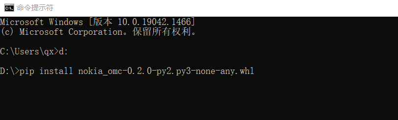
4、安装完毕后执行以下命令查看是否安装成功。
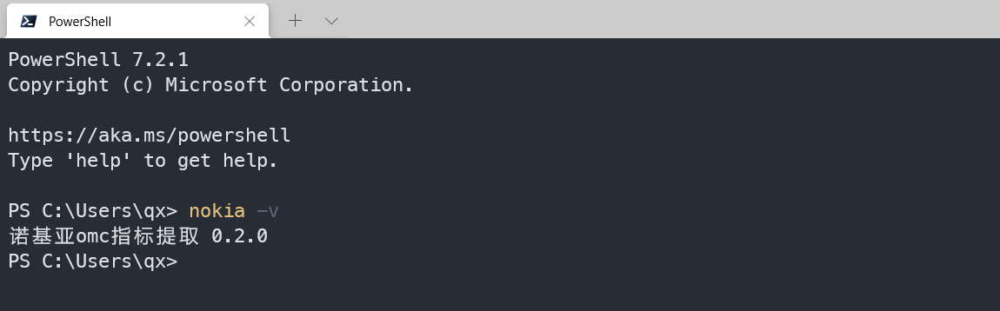
## 程序使用
目前nokia命令可对2G、4G的参数和指标进行并发提取。
### nokia命令帮助信息
终端中输入nokia -h可打印详细帮助信息，subcommands（子命令）是必选参数，指定查询的网络类型（2G或4G）。
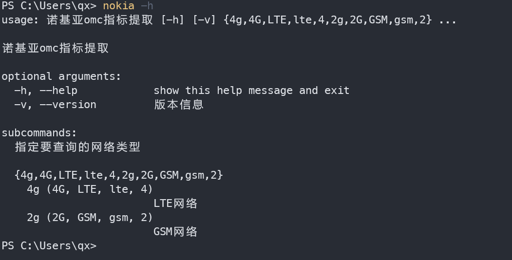
### 二级命令帮助信息
nokia 4 和nokia 2的参数信息是相同的，下面示例中将以nokia 4（4G网络参数指标提取为例进行说明）
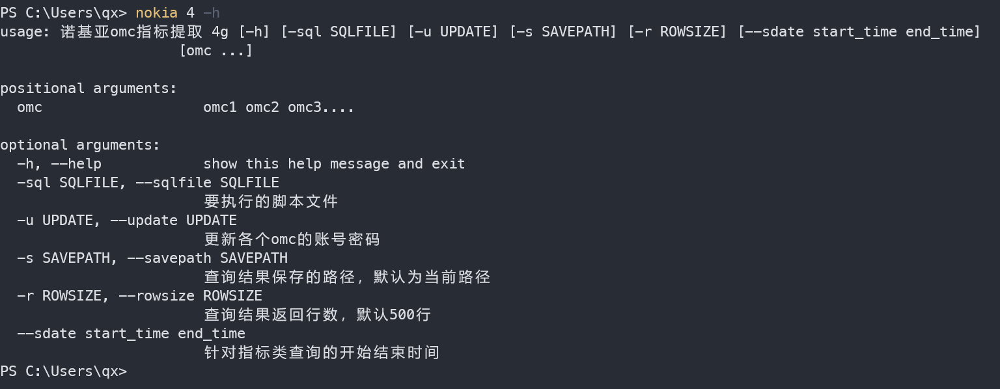
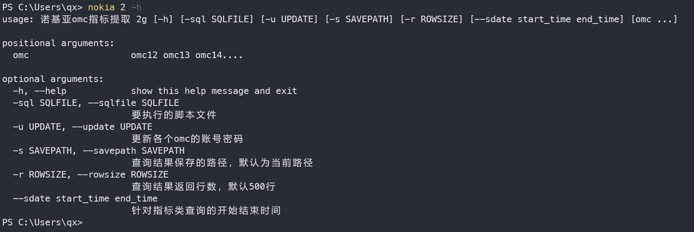
### 示例---4G网络指标提取
#### 更新配置文件（程序首次运行时更新，后续使用不需要在更新，如果Oracle数据库账号密码有修改需要再次更新）
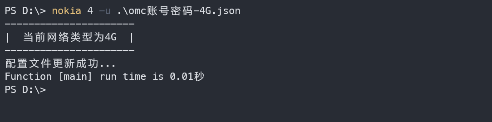
### 参数提取
默认提取4G的所有OMC数据（程序写死的，只对河南有效），查询结果保存在当前路径下。
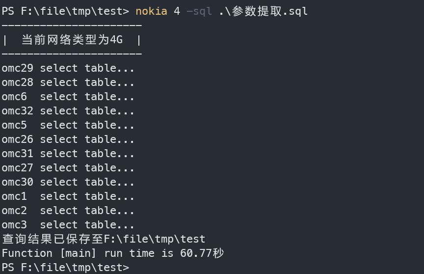
提取部分OMC数据，直接写要提取的omc，多个omc用空格隔开。
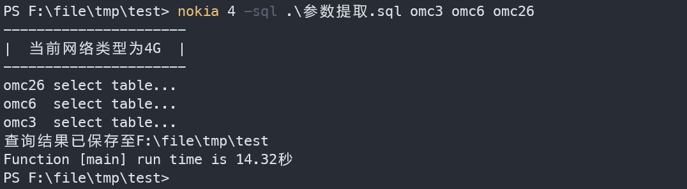
使用-s参数指定查询结果保存路径信息（前提是D盘确实存在参数这个目录）
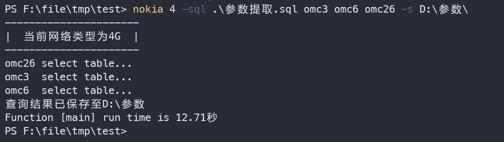
### 指标提取
和参数提取不同，指标提取必须指定--sdate参数 后面跟查询的开始时间，结束时间。查询粒度依据脚本逻辑。
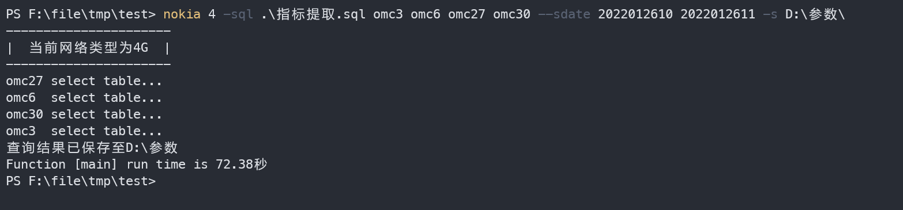
以上为nokia命令常用参数使用示例介绍，其他参数不建议使用。

## 定时提取指标发送邮件程序
### 环境要求
1、Python版本为3.5以上，不要安装最新的3.10版本。
2、安装apscheduler模块。
### 程序结构

data：sql查询结果保存路径
history_data：邮件发送完毕后data目录数据移动到该目录
log：sql查询过程产生的log信息
sql脚本：待执行的sql脚本存放路径
venv：不需要
email_info.py：邮件发送信息
send_mail.py：发送邮件模块
sheduler.py：主程序
### 程序信息修改
email_info.py信息修改，按照注释说明进行修改。
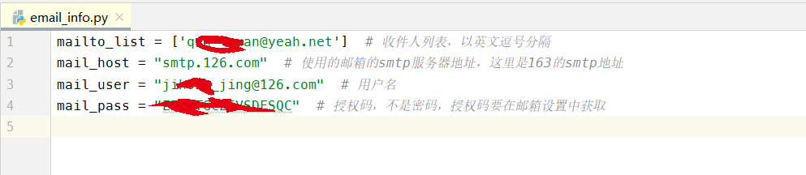
sheduler.py任务信息修改，红色方框内为一个任务逻辑，需要多个少任务，按照红色方框内的格式进行复制粘贴。
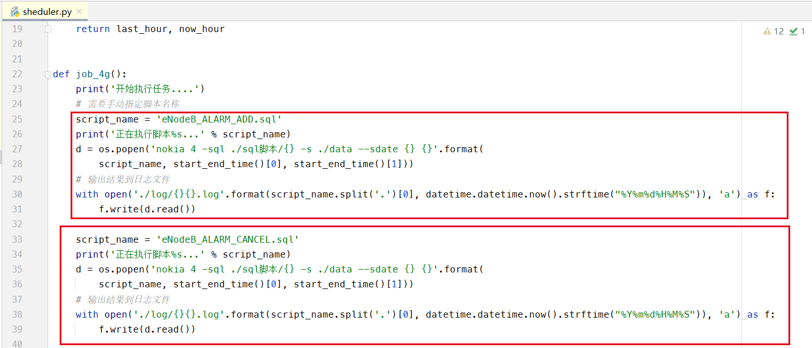
每个任务逻辑单元只需要修改script_name变量，其他的不需要动。
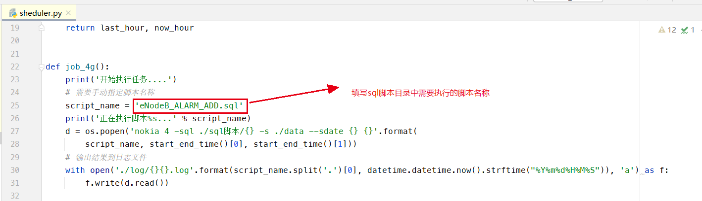
定时任务时间信息修改。
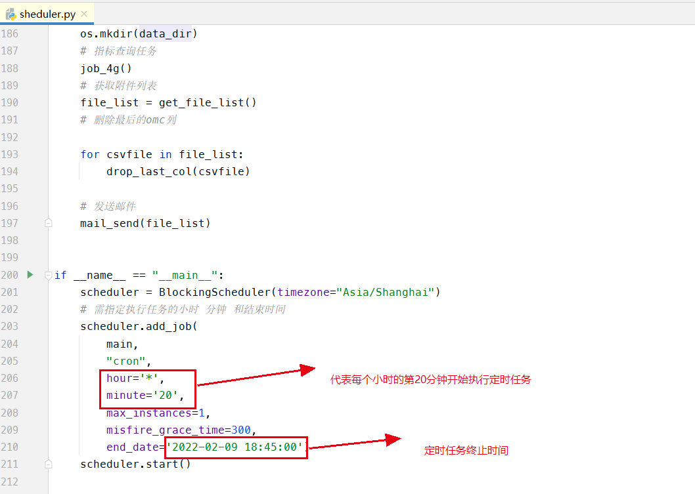
以上信息定制完成后在终端中执行sheduler.py文件启动定时任务。