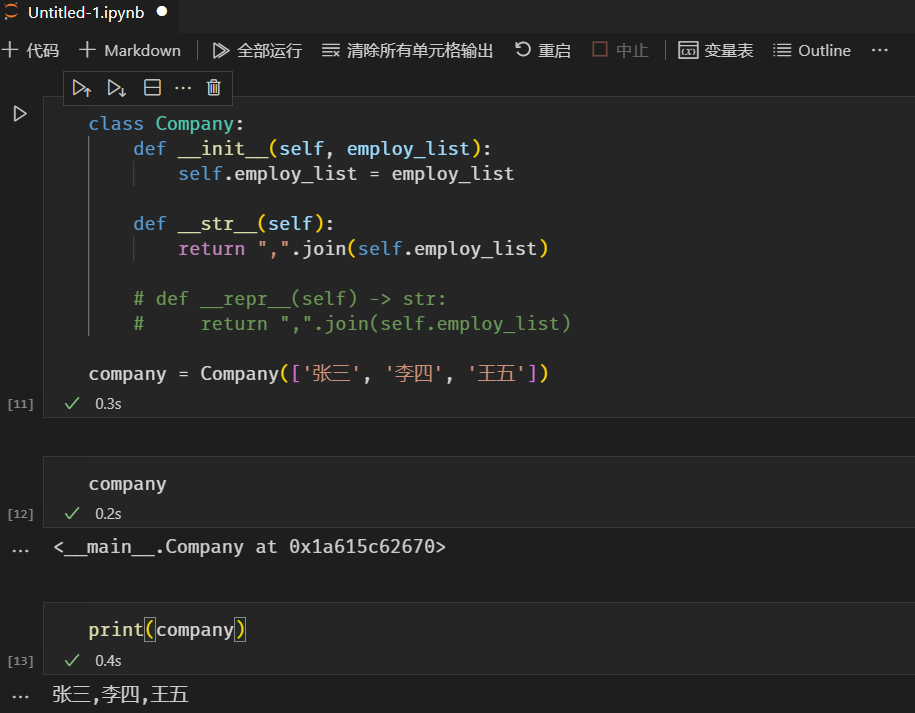
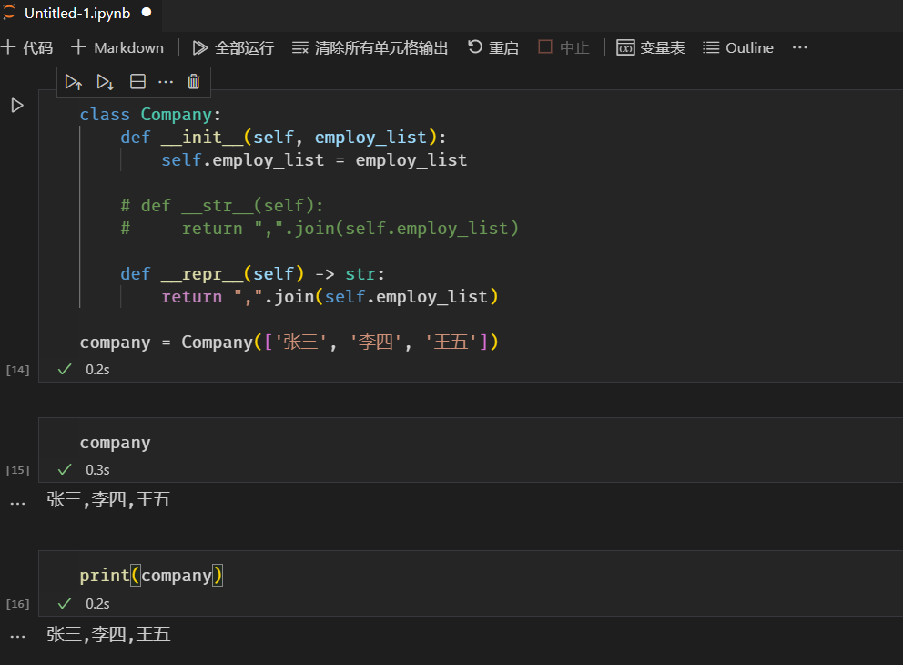

# __str__和__repr__的区别

__str__和__repr__魔术方法可以实现在面向对象编程打印对象时输出特定的字符串。

## 未定义__str__或__repr__魔术方法时

```python
class Company:
    def __init__(self, employ_list):
        self.employ_list = employ_list


company = Company(['张三', '李四', '王五'])
```
定义一个Company类，实例化后用print函数打印company对象，显示的是该对象的内存地址值
```python
print(company)
```
<__main__.Company at 0x1a615079ca0>

## 定义__str__魔术方法

```python
class Company:
    def __init__(self, employ_list):
        self.employ_list = employ_list
    
    def __str__(self):
        return ",".join(self.employ_list)


company = Company(['张三', '李四', '王五'])
```
此时打印company对象将显示可读的字符串。
```python
print(company)
```
张三,李四,王五

## 定义__repr__魔术方法

```python
class Company:
    def __init__(self, employ_list):
        self.employ_list = employ_list
    
    def __repr__(self):
        return ",".join(self.employ_list)


company = Company(['张三', '李四', '王五'])
```
此时打印company对象显示的内容和定义__str__魔术方法显示的内容一致。
```python
print(company)
```
张三,李四,王五

## 不同之处

在普通代码模式（使用print打印对象）下两者是一样的效果，但在开发模式（在jupyter notebook 中输入变量打印信息）下两者是不同的。


定义了__str__魔术方法，直接输入company 显示的仍为对象的内存地址。


定义了__repr__魔术方法，print对象还是直接输入对象执行结果相同，仅限于开发模式（在jupyter notebook 中输入变量打印信息）。