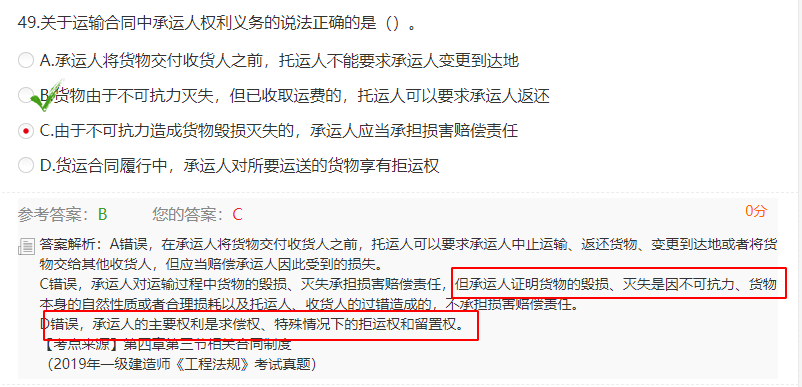
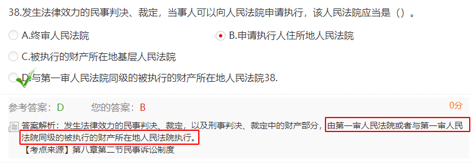
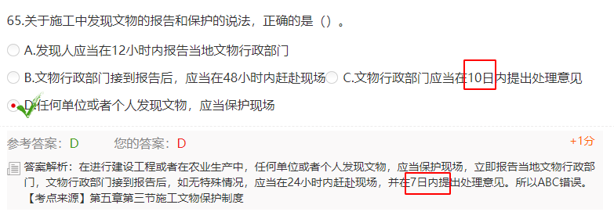
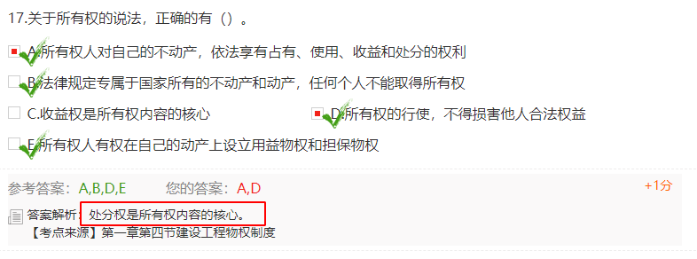

# 法规
## 知识点

建筑工程开工前，建设单位应当按照国家有关规定向工程所在地<mark>**县级以上**</mark>人民政府建设行政主管部门申请领取施工许可证。

在城市规划区内以划拨方式提供国有土地使用权的建设工程，建设单位在班里用地批准手续前，必须先取得该工程的<mark>**建设用地规划许可证**</mark>。

下列情形符合注册建造师申请条件的是（D）
A 甲因执业活动违法受到刑事处罚，2年前刑罚已经执行完毕。  执业活动受到刑罚，执行完毕到申请注册要满<mark>**5年以上**</mark>，非执业活动受到刑罚 要满<mark>**3年**</mark>以上。
B 乙患有精神疾病，经鉴定为限制行为能力人  ----没有民事行为能力
C 丙犯故意伤害罪被判刑，尚在缓刑期间。---受到刑事处罚，刑事处罚尚未执行完毕
D 丁60周岁 ----<mark>**65周岁**</mark>后不能在注册
## 2015年真题

不能出现咱俩签的合同，钱让第三人出了。

工程质量保证金是工程价款的3%

该多选了
## 2016年真题

保定人--实践（实在）

该单选43题了
## 2017年真题

## 2018年真题

和解也是有一定的约束力的，不能说撤销就撤销

划拨土地前，肯定要有明确的用途，先版类规划许可证，要不划拨给你了 你囤积到手里不使用怎么办。

应该是撤诉吧

全国重点文物保护单位和省重点文物保护单位的**保护范围**，均由**省政府划定**。**建设控制地带**，由**省文物局**和**省规划局**共同划定，划定后报**省政府批准**
水3 电2 地90
节能：现场照明设计照度不应低于最低照度，也不应超过最低照度的**20%**
节地：合理安排施工总平，库房料场尽可能靠近大门，临时设施占地面积有效利用率大于**90%**。
力争施工中非传统水源和循环水的再利用量到 **30%**。

不能看人家的金钱往来，不能随便让人家停业

安全生产许可证的违法行为和法律责任

个人独资、合伙企业、个体工商户不征收企业所得税，交个税
企业所得税税率位25%

看到重大再选

只有工伤保险是用人单位单独缴纳的，其他保险都是用人单位和职工共同缴纳

个人购买东西 不开增值税发票，增值税发票抬头是公司

## 2019年真题

注意：生效日期和起点日期不一样

申请施工许可证的前提是有安全生产许可证，所以要确定施工企业，监理单位可以慢慢在找

  

  

## 2020年真题

建筑工程一切险保的就是意外和灾害

重大误解、显失公平、欺诈胁迫、乘人之危订立的合同，只有一方（误解方、不利方、受害方、违心方）可以与对方协商变更或撤销；协商不成的，可以请求法院或者仲裁机构（强行）撤销。
合同未撤销的，自始有效；合同被撤销的，自始无效。

不能找劳务分包，劳务分包都是农民工太可怜

  

建设单位就是跑腿 协调 

租来的房子搞装修，最后租客不可能代业主把房子折价卖了吧

