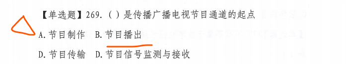
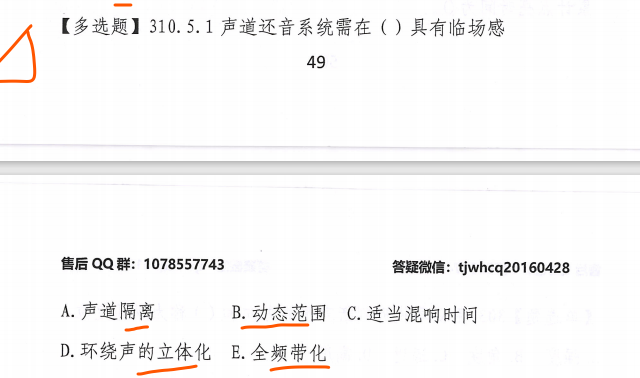
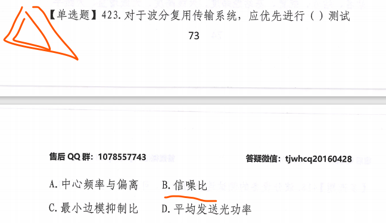
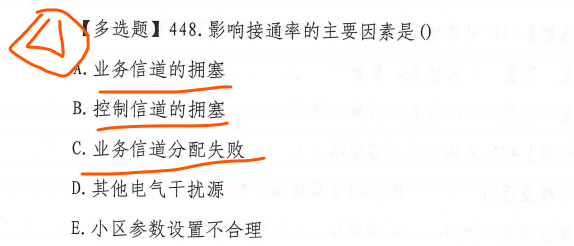
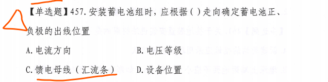

# 实务笔记
# BCWP ACWP BCWS总结
## ACWP>BCWS>BCWP

分析：效率低 进度较慢 投入超前
措施：用工作效率高的人员更换一批工作效率低的人员

## BCWP>BCWS>ACWP

分析：效率高 进度较快 投入延后
措施：若偏离不大，维持现状

## BCWP>ACWP>BCWS

分析：效率较高 进度快 投入延后
措施：抽出部分人员，放慢进度

## ACWP>BCWP>BCWS

分析：效率较低 进度较快 投入超前
措施：抽出部分人员，增加少量骨干人员

## BCWS>ACWP>BCWP

分析：效率较低 进度慢 投入超前
措施：增加高效人员投入

## BCWS>BCWP>ACWP

分析：效率较高 进度较慢 投入延后
措施：迅速增加人员投入

# 施工单位如何做好关键过程的控制
- 制定相应的控制措施
- 进行技术交底
- 落实三检制度
- 确保测量设备处于良好状态
- 指定并落实纠正措施
# 进度计划的编制依据

- 施工合同对工期等相关要求
- 批准的施工图设计 --没记住
- 施工定额
- 现场摸底报告，或者已经掌握的施工现场具体环境及工程的具体特点
- 项目资源供应情况
- 以往类似工程的实际进度及经济指标

# 进度报告分为哪几种
- 工程日报
- 工程周报
- 工程月报
- 工程阶段性报告

# 因施工单位原因导致工期延误，应该采取哪些方式进行进度计划的调整
- 增加施工人员
- 延长施工人员的工作时间
- 增加施工机具、设备、仪表
- 倒班作业
- 改变某些工作的逻辑关系
- 缩短某些工作的持续时间

# 施工图设计审核内容

施工图设计是否完整、齐全，施工图纸和设计资料是否符合国家有关工程建设的法律法规和强制性标准的要求
施工图设计是否有误，各组成部分之间有无矛盾
工程项目的施工工艺流程和技术要求是否合理   -----没记住
对于施工图设计中的工程复杂，施工难度大技术要求高的部分或应用新技术、新材料、新工艺的部分现有施工技术水平和管理水平能否满足工期和质量的要求  ---记的不清楚
明确施工项目所需要主要材料、设备数量、型号、规格、供货情况
施工图中穿越铁路、公路、桥梁、河流等技术方案的可行性
找出施工图中标注不明确的问题并记录
工程预算是否合理

# 设备割接注意事项
测 连 编 计 测
新安装的设备应进行测试，保证其满足入网要求
布放好新旧设备之间的连接线
编写割接报告，报建设单位审批
由建设单位组织，施工单位协助，按计划进行割接
新设备割接入网后，及时做好测试工作

# 在用通信设备、网络安全的防护措施

电 电 尘 设
在用通信设备、网络安全防护主要涉及割接、防尘、原有设备的保护、防静电等工作。要求如下：
- 机房内施工电源割接时，应注意对所使用工具的绝缘防护；通电前应检查新装设备，在确保新设备电源系统无短路、接地、错接等故障时，确认输入电压正常时，方可进行电源割接工作。
- 在机房内施工时，应采取防尘措施，保持施工现场整洁。
- 禁止触动与施工无关的设备。需要用到原有设备时，应经机房负责人同意，以机房值班人员为主进行工作。
- 拔插机盘时，应佩戴防静电手环。

# 机房内施工电源割接应注意事项
1、在电源割接前，对需要进行电源割接的设备进行测试，并且做好测试记录。
2、编制电源割接施工方案，并由维护主管部门审核批准。
3、电源割接时，使用的工具应做好绝缘防护。
4、通电前应检查新装设备，确保新设备电源系统无短路、接地、错接等故障时、确认输入电压正常时，方可进行电源割接工作。
5、电源割接由建设单位统一指挥，按时按计划进行割接操作。
6、割接完成后及时测试，应能达到原水平。
# 电源设备安装质量控制点

- 输入电压
- 输出电压
- 充放电试验
- 绝缘测试
- 保护地线电阻测试

# 电源设备安装的隐蔽项目

电池充放电测试过程和测试值
设备的单机测试过程和测试值
设备的系统的测试过程和测试值

# 简述路由复测的主要任务
五个有核国家修改位置数据
>走方位环境和地点
1. 根据设计核定光缆路由走向及敷设方式、敷设位置、环境条件及配套设施的安装地点。
>方距离障位置
2. 核定和丈量各种敷设方式的地面距离，核定光缆穿越障碍物的具体位置和技术措施。
3. 核定防雷、防白蚁、防强电、防腐等地段的长度、措施及实施的可能性。
4. 核定沟坎保护的地点和数量。
5. 核定管道光缆占用管孔的位置。
6. 根据环境条件初步确定接头位置。
7. 为光缆配盘、光缆分屯及敷设提供必要的数据资料。
8. 修改、补充施工图。
# 材料质量控制点
>墙外检查 墙内记录

- 对全部进场材料的型号、规格、数量、质量清点检查
- 对材料的生产厂家、出厂合格证、入网证检查核对
- 对进场材料做好标识记录

# 公路作业安全防护措施

- 应严格按照批准的施工方案，在规定的区域内施工，作业人员应服从交警的管理和指挥，协助搞好交通安全工作，同时还要保护好公路设施。
- 每个施工地点都应设置安全员，负责按照公路管理部门的有关规定摆放安全标志，观察过往车辆并监督各项安全措施的执行情况，安全标志尚未全部摆放到位和收工撤离收取安全标志时应特别注意，发现问题及时处理。
- 在夜间、雾天或其他能见度较差的气候条件下禁止施工
- 所有进入施工现场的人员必须穿戴符合规定的安全标识服，施工车辆应装设明显标志。
- 施工车辆应按照规定的线路和地点停放、行驶，严禁逆行
- 每个施工地点在收工时，必须认真清理施工现场，保证路面上清洁。
- 各个施工地点的占用场地应符合高速公路管理部门的规定。

# 有限空间作业的要求
批 风 急 训 毒
- 必须严格实行作业审批制度，严禁擅自进入有限空间作业。
- 必须做到先通风再监测后作业，严禁通风监测不合格作业。
- 必须配备个人防中毒窒息等防护装备，设置安全警示标识，严禁无防护监护措施作业。
- 必须对作业人员进行安全培训，严禁教育培训不合格上岗作业。
- 必须制定应急措施，现场配备应急装备，严禁盲目施救。

# 安全管理计划的内容

- 安全管理计划是保证施工安全的纲领性文件，包括如下部分
- 安全管理要求
- 安全检查计划
- 安全控制措施
- 应急预案

# 施工现场的临时仓库应采取哪些防火措施

- 建立消防管理要求，配置消防器材，使用防爆灯具，电源线的线径满足规范要求
- 易燃易爆物品应单独存放
- 仓库内严禁烟火
- 严禁保管人员住在仓库内

# 简述低温季节施工安全注意事项

- 低温季节施工人员应尽量避免高处作业，必须要进行高处作业时应穿戴防冻、防滑的保温鞋帽。
- 光缆熔接机和测试仪表工作时应采取保温措施，以满足其对温度的要求。
- 低温季节吊装机具时，要考虑吊装设备的安全系数。
- 车辆在冬季应加装防冻液，雪天、冰路上行驶时车辆应加装防滑链或使用防滑轮胎，注意防冻、防滑。

# 雨期施工注意事项
雷电路机材，行车封端头
- 雷雨天气禁止从事高空作业，空旷环境中施工人员避雨时应注意防雷。
- 施工人员应注意道路状况，防止滑倒摔伤。
- 雨天与湿度过高的天气施工时，作业人员在与电力设施接触前，应检查其是否受潮漏电。
- 施工现场的仪表及接续机具在不使用时应及时放在专用箱中保管。
- 下雨前，施工现场的材料应及时遮盖；对于易受潮变质的材料应采取防水、防潮措施单独存支置。
- 雨天行车应减速慢行。
- 暂时不用的线缆应及时缩封端头，及时充气。
# 直埋光缆埋深不符合要求的预防措施
- 缆沟开挖深度严格按照设计要求和有关验收标准执行
- 放缆前应清理沟底杂物，全面检查沟底深度，重点检查沟、坎等特殊点沟底的深度，并保持沟底平整
- 光缆应顺直的贴在沟底
- 回填土应满足规范要求

# 简述光缆敷设时打结扣的预防措施
- 敷设光缆时，严格按照施工操作规程进行
- 配备必要的放缆机具，按照规范要求盘好“∞”字形
- 根据不同的施工环境配备足够的敷缆人数
- 控制好放缆的速度
- 在关键点要安排有丰富经验的人员具体负责
- 保证光缆在现场指挥人员的视线范围以内

# 建设单位要求对已完工部分进行验收是否合理？施工单位应如何做？

建设单位的要求合理，符合部分验收的规定，可进行部分验收

- 施工单位应当在部分验收前将已完成的基站的竣工资料编制好，提交建设单位和监理单位审核。
- 审核通过后，可由建设单位组织进行部分验收。
- 建设单位、监理单位和施工单位共同进行部分验收。
- 对验收中发现的问题，应按照建设单位要求进行及时整改，施工单位整改完毕后，由建设单位和监理单位进行复验。
- 复验合格后工程才能投入使用。

# 隐蔽工程随工验收程序

- 项目部向建设单位、监理单位提出隐蔽工程随工验收申请，并提交隐蔽施工前和施工过程的所有技术资料。
- 建设单位、监理单位对隐蔽工程随工验收申请和隐蔽工程的技术资料进行审验，确认符合条件后，确定验收小组、验收时间及验收安排。
- 建设单位、监理单位和施工单位共同进行隐蔽工程随工验收工作，并进行工程实施结果与实施过程图文记录资料的对比分析，做出隐蔽工程随工验收记录。
- 对验收中发现的质量问题提出处理意见，并在监理单位的监督下限期整改。完成后需提交整改结果并进行复验。
- 隐蔽工程随工验收后，应办理隐蔽工程随工验收手续，存入施工技术档案。

# 简述光纤接头损耗大、纤芯在接头盒中摆放不整齐、接头盒安装工艺不符合要求的预防措施

- 对从事光纤接续的技术人员进行技术培训和示范，使其熟练掌握接续、安装要领
- 对切割刀、光纤接续设备和光时域反射仪进行维护和校准，满足施工需要
- 按接头盒说明书的要求进行盘纤，并保证光纤的曲率半径满足规范要求
- 现场环境的温度、洁净度应满足接续要求

# 机房内施工使用电动工具注意事项
人 荷 禁吸烟  
- 在机房内施工作业使用电焊、气割、砂轮锯等设备时，必须有专人看管。
- 电气设备，电动工具严禁超负荷运转。
- 电力线的线径应满足负载电流的要求，接头结实可靠。
- 机房施工现场严禁吸烟。
# 质量监督申报时间

建设单位应在工程开工5个工作日前向通信工程质量监督机构办理质量监督申报手续

# 简述电杆倾倒的预防措施

- 电杆进场要进行严格的质量检查，符合出场标准
- 直线杆路中间杆位的左右偏移量不得超出验收规范要求
- 杆跟装置应按设计和相关操作规程安装，电杆埋深应符合验收规范或设计要求
- 不同位置电杆的垂直度、拉线距高比、地锚的埋深和地锚出土点的左右偏移量均应满足规范要求，不得随意改动地锚的位置
- 电杆回填土要夯实
- 杆路的档距和杆上负荷必须符合工程设计要求、收紧吊线时应松开吊线上的夹板

# 管道漏水的预防措施
两头堵好 接头禁锢 
- 敷设的塑料管在接头时，管孔接头不得松弛
- 接头两端的橡胶圈的质量应良好
- 接头处应严密封堵
- 在人手孔内管孔两端应严密封堵

# 硅芯管漏气的预防措施

>按照工序顺序记忆

- 硅芯管运抵工地后应做保气实验
- 敷设时严禁在地面上拖、磨、刮、蹭、压
- 回填土时不要使石头等尖状物体损坏硅芯管
- 用接头套管接续时，一定要保持接头严密
- 每段接续完成后，可回填部分细土，应按要求做保气实验，确认不漏气后在回填土

# 线缆布放不整齐的预防措施
- 布放线缆前应设计好线缆的截面积
- 严格按施工操作规程和工程验收规范要求放缆
- 线缆绑扎的松紧度应符合要求
- 做好线缆的整理工作

# 简述施工单位如何处理工程中剩余材料
- 对于建设单位采购的物资，物资管理人员应负责向建设单位移交剩余物资，办理相应的手续。
- 对于项目部采购的物资，应在工程完工后保管好剩余的物资，经盘点进货数量、使用数量、剩余数量，通过成本核算和会计核算后，移交给施工单位指定部门

# 质量监督申报方法和内容

建设单位办理质量监督申报手续，应当通过质监管理平台提交《通信建设工程质量监督申报表》和以下文件材料
1、项目立项批准文件
2、施工图设计审查批准文件
3、工程的勘察、设计、施工、监理等单位的资质等级证书
4、其他相关文件

# 竣工验收备案

时间：建设单位应在竣工验收合格之日起15日通过质监管理平台提交《通信工程竣工验收备案表》以及通信建设工程竣工验收报告。
提交的资料：
通信工程竣工验收备案表
工程验收证书
施工单位签署的工程质量保修书
法规、规章规定必须提供的其他文件

# 简述竣工验收的依据

- 可行性研究报告
- 施工图设计及设计变更洽商记录
- 设备的技术说明书
- 现行的竣工验收规范
- 主管部门的有关审批、修改、调整文件
- 工程承包合同
- 建筑安装工程统计规定及主管部门关于工程竣工验收的文件

# 项目经理阻拦质量监督机构人员检查是否合理
不合理
通信管理局依据有关质量法规、章程行使质量监督职能是其法定职责，施工单位应自觉接受检查，并予积极配合。

# 通信线路直埋光缆工程中的隐蔽工程随工验收

路由位置
埋深及沟底处理
与其他设施的间距
缆线的布放质量
排流线的埋设质量
引上管及引上缆的安装质量
沟坎加固等保护措施的质量
保护和防护设施的规格数量和安装地点及安装质量
接头装置的安装位置及安装质量
回填土的质量

# 安全员的主要职责

现场安全检查
发现违章作业者直接纠正
检查施工机具、仪表、设备有无安全隐患
参与安全技术交底，明确安全管理要求
及时处理检查中发现的安全事故隐患
检查危险性较大的分部分项工程安全专项方案实施

# 安全事故的报告
发生通信建设工程生产安全事故后，事故现场有关人员应立即向本单位负责人报告，单位负责人接到事故报告后，应当于1小时内向事故发生地县级以上人民政府安全生产监督管理部门和所在地省级通信管理局报告。
事故发生单位负责人接到事故报告后，应当立即启动事故处理应急预案，或采取有效措施，组织抢救，防止事故扩大，减少人员伤亡和财产损失。
对于特别重大事故、重大事故、较大事故，通信管理局应于收到报告后2小时内向工业和信息化产业部报送通信工程生产安全事故报表。

# 质量事故等级划分
一般质量事故：20万以下小型项目不能按期投产使用
严重质量事故：重伤1至2人，50万以下大中型项目不能按期投产使用
重大质量事故：死亡或重伤3人及以上，50万以上大中型项目不能按期投产使用

# 质量事故报告程序

质量事故发生后，建设单位必须在24h内以最快的方式将事故简要情况上报主管部门和通信工程质量监督站，遇有人身伤亡时应同时上报安全主管部门，并在48h内提交质量事故的书面报告

# 质量事故报告内容
时、程、损、因、措、位

事故发生的时间、地点、项目名称和单位名称
事故发生的简要过程、伤亡人数和直接经济损失的初步估算
事故发生原因的初步判断
事故发生后应采取的措施和控制情况
事故报告单位

# 质检员的主要职责
- 负责过程的质量检验和认定，对施工过程进行工序质量监控
- 检查管理人员的管理方法是否存在问题
- 施工人员的施工方法是否存在问题
- 检查施工过程中机械、设备、仪表、材料的规格、型号是否满足工程要求
- 检查工作做好记录

# 通信工程工作分解应考虑哪些因素
- 项目承担者的角色
- 工程规模和复杂程度
- 风险程度
- 承（分）包商或工作队伍的数量
- 各层次管理者对项目计划和实施状况报告的结构、详细程度和深度要求
# 施工组织设计的编制人审批人

施工组织设计应由项目负责人主持编制，由施工单位技术负责人或技术负责人授权的技术人员审批

# 施工组织设计编制依据
法批 设 同 供 平 规 模 条件

与工程有关的法律法规，相关单位的批示文件及有关要求；
设计文件，设计会审纪要等；
工程施工合同或招投标文件；
工程施工范围内的现场条件、工程地质及水文地质、气象等自然条件；
与工程有关的资源供应情况；
施工企业的生产能力、机具设备状况、技术水平等；
有关的规范、规程、标准及技术经济指标；
公司的施工组织设计模板及有关的参考资料。

# 安全生产费

安全生产费按照建筑安装工程费的1.5%计取。
安全生产费应当按照 企业提取、政府监督、规范使用、确保需要的原则进行管理。

# 质量保证金

发包人应根据确认的结算报告向承包人支付工程竣工结算价款，并保留不高于工程价款结算总额的3%的工程质量保证金。待工程质保期到期后清算。

# 企业定额可运用于施工单位的哪些管理活动
投  签  分  料  投钱分了
- 投标报价
- 合同签订
- 成本计划的编制
- 成本指标的下达
- 成本控制责任制的考核
- 材料的使用
- 工作量的分配

# 施工单位控制项目成本，应采用的合理施工方法
- 工程项目开工前，项目部应认真会审图纸，针对工程项目编制先进的、经济合理的施工组织设计，制定可行的施工方案和成本控制计划。
- 施工过程中，施工单位应根据工程的具体特点加强质量管理，组织均衡施工，减少窝工、返工等问题，控制质量成本及成本开支。
- 工程收尾阶段，项目部应认真编写竣工资料，保证工程项目顺利验收，减少不必要的开支。

# 施工单位如何控制施工阶段的成本
- 人工费的控制实行量价分离的方法，将作业用工及零星用工按定额工日的一定比例综合确定用工数量与单价，通过劳务合同进行控制。
- 材料费同样按照量价分离的原则，控制材料的用量和材料的价格。
- 合理选择施工机械设备，合理使用施工机械设备，有效控制施工机械使用费。
- 合理控制分包费用。

# 施工单位如何控制分包费用
结网平价
- 做好分包工程询价
- 订立平等互利的分包合同
- 建立稳定的分包关系网络
- 加强施工验收和分包结算

# 线缆端接的假焊和虚焊预防措施
人机料法环
- 焊接前，组织人员进行示范和操作技术交底
- 选派有经验和合格的操作人员与质量检验人员进行操作和及时检查
- 选用合格的焊接工具，并保证焊接工具工作时的温度满足要求
- 应防止烙铁头氧化不沾锡
- 使用合适的焊剂
- 焊锡丝的质量应合格

# 室外馈线受潮，损耗大的预防措施
要严格按照操作规程和操作工艺对馈线接头进行防水处理，在接头出缠绕防水胶带时必须由下而上缠绕，使接头防水可靠。

# 天线方位角误差较大的预防措施
>想想调天线时的流程，塔工先用罗盘量下方位，上塔调天线后固定天线
- 使用罗盘或场强仪测定，准确定位
- 调整天线支撑架的位置，固定牢固

# 与电力线交越施工时，施工人员应采取哪些防触电措施？对杆路应采取哪些保护措施
作业人员应佩戴安全帽、绝缘手套、穿绝缘鞋和使用绝缘工具
作业前，用试电笔测试电杆上附挂物是否带点，在确认不带电后方可作业
架设吊线前，应通知供电部门派人到施工现场配合施工
严禁使用任何方法将钢绞线抛过电力线，钢绞线不得搁在电力线上拖拉，应采用绝缘棒或搭保护架保护
***
杆路应采取的保护措施
交越处的掉线加装电力线保护套管
如交越电杆为角杆时，拉线应加装绝缘子
与电力线的垂直净距离满足规范要求
# 交越施工应采取的安全措施

按照设计进行施工，新建光缆应按照有关通信工程建设标准的规定与原有光缆相距一定距离，避免同沟敷设
与原有光缆建设单位协调，在方便维护、确保原有光缆安全的前提下施工
开挖前了解原有光缆的位置和走向
人工小心开挖，严禁使用机械开挖
做好应急预案
做好工前的安全教育和安全技术交底

# 地下设施的安全防护措施

开挖土石方前，应及时通知管线产权单位，充分了解施工现场的具体情况，确定保护地下管线和其他设施的方案。
开挖城市路面前，应与当地规划部门联系，必要时用仪器探明地下管线的深度和位置。
应人工开挖，禁止使用大型机械，对暴露的管线应及时采取防护措施。
施工过程中挖出文物时，项目经理部应保护好现场，并及时向文物管理部门报告，等候处理。

# 光缆中继段测试项目

中继段光纤线路衰减系数及传输长度测试----中继段光纤线路衰减测试记录表（测试仪表：光时域反射仪OTDR）
光纤通道总衰减----中继段光纤通道总衰减测试记录（测试仪表：稳定的光源和光功率计）
光纤后向散射曲线----中继段光纤后向散射曲线（测试仪表：光时域反射仪OTDR）
光缆对地绝缘测试----光缆线路对地绝缘测试记录（测试仪表：高阻计或500伏兆欧表）
光纤偏振模色散和色度色散测试----中继段光纤偏振模色散系数测试记录（测试仪表：PMD测试仪和CD测试仪）

# 闹市区人行道上拉线的防护措施

应根据设计规定加装绝缘子
人行道上易被行人触碰的拉线应设置拉线标识
在距离地面2m一下的部位用绝缘材料保护

# 建设单位提出工程变更是否合理

- 建设单位提出工程变更合理
- 因为工程变更没有超过合同规定的工程范围，预先商定了变更工程量的价格
- 施工单位的做法合理（拒绝变更）
- 因为工程变更不能超过合同规定的工程范围，超出这个范围，承包商有权不执行变更。

# 建设单位增加两项工作，A在工程范围内，B不在工程范围内
- 施工单位必须接受A工作，B工作施工单位可接受也可以拒绝
- 如果施工单位两项工作都想接受，则应按照“先签证后施工”的工作要求，应在接受发包人要求的7天内就B工作所需的用工数量和单价、机械仪表台班数量和单价、使用材料和金额等向发包人提出施工签证，发包人签证后施工
- 如果发包人未签证，承包人施工后发生争议的，责任由承包人负

# 索赔的依据
- 合同文件
- 法律法规
- 工程建设惯例

# 索赔文件包括哪些部分
- 总述部分
- 论证部分
- 索赔款项（工期）的计算
- 证据部分

# 施工单位如何提高索赔的成功率

- 编写好索赔报告
- 充分论证索赔权
- 合理计算索赔工期和费用
- 提供充足的索赔证据
- 按时提出索赔
- 力争友好协商
- 必要时施加压力
- 按月结算

# 发包人对工程质量有异议的如何处理

- 已竣工验收或已竣工未验收但实际投入使用的：---工程已经归业主了
质量争议按照工程保修合同执行
- 已竣工未验收也未投入使用的工程以及停工、停建工程：  ----工程还是施工单位在搞
应当就争议的部分暂缓办理竣工结算。双方可就有争议工程提请通信行业主管部门协调或申请仲裁，其余部分的竣工结算依照约定办理

# 建设工程竣工资料
建设工程竣工资料分为竣工文件、竣工图、竣工测试记录三大部分。
## 竣工文件包括
- 工程说明
- 开工报告
- 建筑安装工程量总表
- 已安装设备明细表
- 工程设计变更单及洽商记录
- 重大工程质量事故报告
- 停（复）工报告
- 隐蔽工程随工验收签证
- 交（完）工报告
- 验收证书
- 交接书
## 竣工图纸应满足的要求

- 竣工图的内容必须真实、准确，与工程实际相符合 ---没记住
- 利用施工图改绘竣工图，必须表名变更依据。凡变更部分超过图面三分之一的，应重新绘制竣工图
- 所有竣工图纸均应加盖竣工图章。竣工图章的基本内容包括“竣工图”字样、施工单位、编制人、审核人、技术负责人、编制日期、监理单位、总监理工程师。竣工图章应使用不易褪色的红印泥，盖在图标栏上方空白处。 ---没记住

2月初，某通信工程公司与C市通信运营公司签订一项光缆传输设备安装工程的施工合同。合同金额60万元，工程采用包工不包料的方式，工期为3个月，自3月1日开工5月31日完工。合同按照国家相关文件规定对工程价款的结算方式和支付时间，保修金，工程变更等事项进行约定。施工单位按合同约定的工期和施工内容保质保量的完成了本工程，同时将竣工资料和工程结算文件送达建设单位，该工程与6月15日经过初验后开始试运行，至9月15日结束，9月25日该工程进行了终验，并正式投入运行。
1、工程预付款应该在什么时候支付，应支付多少？
2、建设单位应在多少天内完成工程结算的审查工作，应何时支付工程结算款，建设单位应保留多少比例的保修金？
3、施工单位应何时开始向建设单位清算保修金？

工程预付款应在不迟于约定的开工日期前的7天内支付，应支付的预付款金额为12万元。
因工程结算额在500万元一下，建设单位应在20日内（6月20日前）完成结算资料的审查；
并在初验后3个月内（9月15日前）结算工程价款；建设单位应保留3%的保修金。
施工单位应待工程质保期满，即第二年的9月25日开始向建设单位清算保修金。

# 工程结算文件的内容

- 工程价款结算文件包括：
>工程价款结算编制说明
>工程价款结算表格

- 工程价款结算编制说明包括：
>工程结算总价款
>工程款结算依据
>因工程变更等导致工程价款增减的主要原因

# 施工单位应采取哪些管理措施，防止安全事故再次发生

建立健全安全生产管理制度；
做好安全教育和施工前安全技术交底，使作业人员掌握安全操作规范；
配备必要的防护装备和救援装备；
做好应急预案及演练；

# 馈线进入室内时，应采取哪些措施

- 馈线金属护层应在进入馈线窗外侧良好接地
- 馈线在进入馈线窗前应做放水弯
- 馈线进入室内与软跳线连接处应接防雷器
- 封堵馈线孔

# 合同关键条款

- 承包范围、工程量、合同价款、工期
- 质量标准、安全要求
- 合同双方的责权利
- 付款方式、工程变更和索赔的处理方法、不可抗力的范围、质保期和质保责任
- 违约责任
- 争议的处理方法
# 监理工程师或建设单位的口头变更施工单位是否要遵守
- 对于建设单位或工程师的口头变更指令，施工单位也必须遵守执行
- 但施工单位应该在7天内书面向工程师索取书面确认
- 如果工程师在7天内未予书面否决，则施工单位的书面要求即可作为工程师对该工程变更的书面指令
- 工程师的书面指令是支付变更工程款的先决条件之一

# 工程竣工结算报告的审查时限要求
应从接到竣工结算报告和完整的竣工结算资料之日起N天内完成审查。
范围如下：

|   工程款范围   | 结算时间 |
| ------------- | -------- |
| 500万以下     | 20天内   |
| 500万-2000万  | 30天内   |
| 2000万-5000万 | 45天内   |
| 5000万以上     | 60天内   |
# 子架安装的基本要求

- 子架安装位置应满足设计要求
- 子架与机架的**加固应牢固、端正**，满足设备装配要求，不得影响机架的整体形状和机架门的顺畅开合
- 子架上的饰件、零配件应装配齐全，接地线应与机架接地端子可靠连接
- 子架内机盘**槽位**应满足设计要求，**插接件接触良好**，空槽位宜安装空机盘或假面板

# OTDR设备

横轴：代表距离，单位KM
纵轴：代表光功率，单位dB

# 保修期内工程出现问题，但是责任不在施工单位怎么处理

因为项目采用包工不包料方式，施工材料并非施工单位提供，所以铁件锈蚀腐蚀是非施工单位原因造成的质量问题，施工单位应积极配合建设单位分析原因，进行处理
施工单位应尽快派人前往检查，并汇同建设单位做出鉴定，提出修复方案，并组织好人力物力进行修复。
在发生问题的部位修复完毕后，在保修证书内做好保修记录，并经建设单位验收签字，以表示修理工作完成且符合要求
# 光电缆线路工程施工现场准备
- 现场考察
- 地址条件考察
- 建立临时设施，建立分屯点
- 与当地有关部门取得联系

# 光电缆管道工程施工现场准备
- 管道路由考察
- 考察其他管线情况
- 了解当地的砖、瓦、灰、砂、石等地材的供应情况
- 建立临时设施
- 安装调试施工机具
- 与当地有关部门取得联系

# 设备安装工程的施工现场准备工作
口诀：考证存防（房）卫生纸

- 机房现场考察
- 办理机房准入证件
- 设计图纸现场复核
- 安排设备仪表的存放地
- 在用设备的安全防护
- 机房环境卫生的保障

# 设备安装工程施工图纸现场复核内容
口诀：设 线 电 保 板

需要安装的设备位置、数量是否准确有效
线缆的走向、距离是否准确可行
电源电压、熔断器容量是否满足设计要求
保护接地的位置是否有冗余
防静电地板的高度是否和防震基座的高度相符
***
# 杨鹏选择题难点
分 传（床） 调（叼） 性 切
* 传送网独立于具体业务网，负责按需为交快节点/业务节点之间的互连**分配电路**，为节点之间信息传递**提供透明传输通道**，它还具有**电路调度**、**网络性能监视**、**故障切换**等相应的管理功能。

* 一个完整的通信网除有以传递通信业务为主的业务网之外，还需有若干个用来**保障业务网正常运行**、**增强网路功能**、**提高网路服务质量**的支撑网路。支撑网是现代通信网运行的支撑系统。   支持网的功能

* 同步网是现代通信网运行的支持系统之一，处于通信网的最底层，负责实现网络节点设备之间和节点设备与传输设备之间信号的**时钟同步**、**帧同步**以及全网的**网同步**，保证地理位置分散的物理设备之间的数字信号的正确接收和发送。 同步网的功能

* 按信号在传输介质上的复用方式的不同，常用的复用技术有**基带传输技术**、**频分复用(FDM)技术**、**时分复用(TDM)技术**和**波分复用(WDM)技术**   注意没有码分复用技术

* 基于SDH的**多业务传送平台**(MSTP)是**SDH与以太网初步融合的产物**。MSTP可以更有效地支持分组数据业务，有助于实现从电路交换网向分组交换网的过渡，**适用于已经部署大量SDH网的运营商**

* **程控数字交换机**采用**时分交换**的交换方式

颠 倒 没
* 为了便于网络设计与管理，**接人网**按垂直方向分解为**电路层**、**传输通道层**和**传输媒质层**三个独立的层次

道路传媒
* PTN网络结构分为**通道层**、**通路层**和**传输媒介层**三层结构

* 光纤接入网在用户端则要利用**光网络单元(ONU)**进行光/电转换，恢复成电信号后送至用户终端设备

* **固定无线接入**的主要技术有**LMDS**、**3.5GHz无线接入**、**MMDS**、**固定卫星接入技术**、**不可见光无线系统**

* **移动无线接入**技术有：**蜂窝移动通信系统**、**卫星通信系统**、**集群调度系统**、**无线市话（PAS）**以及用于短距离无线连接的**蓝牙技术**等

* 通过合理的网络管理，将某时刻计算机上处于超负荷的任务分送给别的轻负荷的计算机去处理，达到均衡负荷的目的。这对**地域跨度大**的远程网络来说，充分利用**时差因素**来达到均衡负荷尤为重要。

* 物联网通过**二维码识读设备**、**射频识别(RFID)装置**、**红外感应器**、**全球定位系统**、**激光扫描器**等信息传感设备，按约定的协议，把任何物品与互联网连接起来，进行信息交换和通信，以实现智能化的识别、定位、跟踪、监控和管理。

* 双纤单向传输系统中不同波长的已调光信号通过光合波器耦合在一起，并在**一根光纤**中单向传输。

* 双纤单向传输系统同一波长在两个方向上**可以重复利用**

* 单纤双向传输系统总的FWM产物比双纤单向传输**少的多**

* 现在DWDM系统绝大多数采用的是**开放式系统**

* 合波器在高速大容量波分复用系统中起着关键作用，其性能的优劣对系统的传输质量有决定性影响。其功能是将不同波长的光信号耦合在一起，传送到一根光纤里进行传输。这就要求合波器**插入损耗及其偏差要小**，**信道间串扰小**、**偏振相关性低** 

* PTN是面向分组的、支持传送平台基础特性的下一代传送平台，其最重要的两个特性是**分组**和**传送**

* PTN的功能分为**传送平面**、**管理平面**和**控制平面**三层

* PTN中的**分组交叉**帮助运营商可实现不同业务需求灵活配置不同业务容量即通过更换不同线卡就可实现

* PTN利用传送平面的OAM机制，为选定的工作实体预留了保护路由和带宽，不需要控制平面的参与就可以提供小于**50ms**的保护，主要包括**线性保护**和**环网保护**

* **线性保护**倒换包括**1+1、1: 1和1: N**方式，支持**单向**、**双向**、**返回**和**非返回**倒换模式。**环网保护**支持的**转向**和**环回**机制

* PTN在保护特性上典型要求是**50ms的保护倒换时间**，**端到端的通道保护**以及**群路线路保护**和**节点保护**

* 电缆接口包括TDM E1、IMA E1 、xDSL，FE和GE等;光纤接口包FE、GE、10GE和STM-n等;微波接口包括Packet Microwave

* IEEE1588v2精确时间协议技术实现主从时钟的**频率**、**相位**和**时间**的同步

* 微波使用的波段 L S C X Ku K （**拉屎擦翔库克**）

* 微波站中常用的天线是**卡塞格林**天线

* 微波馈线有**同轴电缆型**和**波导型**两种

* 一般在**分米**波段(**2GHz**)，采用**同轴电缆**馈线，在**厘米**波段(**4GHz**以上频段)因同轴电缆损耗较大，故采用**波导馈线**

* SDH数字微波通信系统多采用多进制编码的**64QAM**、**128QAM**、**256QAM**和**512QAM**的调制方式   没有32QAM  32位操作系统都没人用了

* 如采取将微波反射点从水面移至森林或凹凸不平的地面，属于**反射点设在反射系数较小的地面**方法克服电磁波衰落

* 有时收发天线均很高，而反射点又处于途径中间的开阔地或水面上，应采用**利用天线的方向性**方法克服电磁波衰落

* 当路由中存在较高障碍物时，为了克服在大气折射时产生绕射衰落，应采用用**无源反射板 背对背天线方法**克服电磁波衰落

* VSAT系统可工作于**C波段**或**Ku波段**，终端天线口径小于**2.5m**，由主站对网络进行监测和控制

关于VSAT网络结构说法错误的是（）
A. 通信卫星可以是专用卫星，但大多数都是租用卫星转发器
B 网络控制中心是主站用来管理、监控VSAT专用长途卫星通信的重要设备
C 接口单元对VSAT小站设备的运行情况进行实时监控  ----主站
D VSAT小站可直接与电话机、交换机、计算机等各种用户终端连接

独立性强，可靠性高，智能化高
VSAT卫星通信网络的主要特点是（A）  
A 互操作性好，保密性差
B 组网灵活，独立性差
C 通信效率高，可靠性差
D 设备简单，智能化低

在传输**实时要求高的业务**时，采用**网形结构**，而在传输**实时性要求不高**的业务时，采用**星形结构**;当进行**点对点**通信时采用**网形结构**，当进行**点对多点**通信时采用**星形结构**
下列（AC）情形需要采取网形结构
A    传输实时要求高的业务
B    传输实时性要求不高的业务
C    进行点对点通信通信时
D    进行无中继通信

同频小区的距离计算

容易遗漏OSS和MS
2G移动通信网络主要由（ABCD）组成
A    移动交换子系统 NSS
B    基站子系统 BSS
C    移动台 MS
D    操作维护子系统OSS
E    移动交换中心 MSC

AUC一般与HLR处于同一位置
关于移动交换子系统说法不正确的是（）
A    MSC是NSS的核心部件
B    VLR用来存储来访用户信息，一个VLR为一个MSC控制区服务
C    HLR是用来存储本场用户信息的数据库，一个HLR能够控制若干个移动交换区域
D    AUC一般与VLR处于同一位置

**OSS**提供远程管理和维护网络的功能，一般由网络管理中心(**NMC**)和操作维护中心(**OMC**)两部分组成。**NMC**提供全局性的网络管理功能，用于**长期性规划管理**，**OMC**提供区域性的网络管理功能，用于**日常维护操作**，包括事件/告警管理、故障管理、性能管理、配置管理和安全管理。

ims将移动通信网络技术、传统固定网络技术和**互联网技术**有机结合起来
这应该是一个多选题

多交能软

体会出入连接

U终=1.66+0.0175h
3和4，饿了吧

包层是紧挨着纤芯的，涂覆层是最外面的。
**涂覆层**的作用是保护光纤**不受水汽侵蚀和机械擦伤**，还有增加光纤的**机械强度与可弯曲性**，起着**延长光纤寿命**的作用

单模光纤的几何尺寸和波长是一个数量级，多模光纤的几何尺寸远大于波长

G.657光纤分为A类和B两大类。其中A类光纤与G.652D光纤能完全兼容，B类则不要求与G.652D光纤兼容，为了能与目前馈线光缆和配线光缆中广泛使用的G.652D光纤相兼容，我国入户光纤均以G.657A光纤为主

扭绞长度越短，抗干扰能力越强

CAT7适用于高速网络应用，可以提供高度保密的传输

**光电转换**(摄像)是利用摄像管或**CCD器件**，**电光转换**(显像)是利用 **CRT**(阴极射线管)、**LCD**(液晶显示器)和**PDP**(等离子显示板)等器件。

广播电视系统分类：
1、广播电视中心-----制作节目的
2、广播电视发射系统-----发射塔，把信号发射出去
3、广播电视有线传输系统---同轴电缆 光纤传输
4、广播电视卫星传输系统---卫星传输
5、广播电视监测系统---质量监测

信号发送子系统属于广播电视中心，要注意

打不， 打人吗  好打人

将屏幕的物理分辨率达到3840 x 2160 (4 K x  2K )及以上的电视称之为超高清电视
高分辨率，支持3840x 2160 (4K)和7680x 4320 ( 8K )两种分辨率，具有更好的大屏幕体验

数字（自）态

混响时间的大小与：房间容积，墙面、地板、顶棚材料吸声系数有关

电视是广播的形式，一个人看和1万个人看没区别

大型(400㎡以上)演播室、中型(200㎡左右)演播室和小型(100㎡以下)演播室

人耳能听到的声音频率为**20-20000Hz**，人耳对**3000-5000Hz**的声音感觉最灵敏。

重放立体声时的最佳昕声位置，是在以左、右扬声器连线为底边的等边三角形的顶点处。

听无毯，录有毯
立体声听音房间的**混响时间不应太长**，为控制混响时间可采用安装窗帘或幕布等方法。没有铺设地毯。

录音室：为**满足有适当的混响时间**，录音室的墙壁和顶棚上应布置适当的吸声材料，在地面上要铺上地毯。

中波526.5-I 606.5kHz ，共划分**120**个频道，在此频段无线电波传播的特点是沿地面传播的地波衰减较小，可在**几十公里至百余公里**的范围内形成一个不稳定的地波服务区
短波3.2-26.1MHz，在此频段内地波不能形成有效服务区，而电波不能完全穿透电离层，被大约距地面130km以上的电离层所反射，在离短波发射机**几百公里至几千公里**以外的地方形成服务区，因此短波频段适用于远**距离的国际广播**

天线仰角，不是俯角

邻频传输系统又分为300MHz、450MHz、550MHz、750MHz和1000MHz系统，非邻频传输系统又分为VHF，UHF和全频道系统

电缆**主走道及槽道**的安装位置应符合施工图设计的规定，左右偏差不得超过**50mm**
**水平走道**应与列架保持平行或直角相交，水平度每米偏差不超过**2mm**

按照机架底角孔洞数量安装底脚螺栓，机架底面为600mmx 300mm及其以上时应使用4只，机架底面在600mmx 300mm以下时，可使用2只。整列机架前后允许偏差为3mm。

门开关告警应安装在门框内侧，防止别人偷走。

光纤布放收信、发信排列方式应符合**维护**习惯

**10mm²及以下**的单芯电力线宜采用打接头圈方式连接
**10mm²以上**的电力电缆应采用铜铝鼻子连接

列 告 宗 主

航空障碍信号灯所用电力电缆应穿金属管，每隔10m就近接地。

电力设备整流器输入端、UPS输入端、通信用空调输入端、市电油机转换屏的输入端应加装避雷器。
电力设备**直流配电屏输出端**应加装浪涌吸收保护装置。

正常照明：市电供电
事故照明：蓄电池供电
保证照明：备用电源（油机）供电

天线调测要认真细心，严格按照要求操作。当站距在45km以内时，接收场强的实测值与计算值之差允许在1.5dB之内;当站距大于45km时，实测值与计算值之差允许在2dB之内。

电源线室内部分用扎带扎固，应采用下面平行上面交叉方式。

背突  驼背

对于波分复用传输系统，应优先进行**信噪比**测试

移动网络测试：
网络功能和性能检验： 单站验证
呼叫质量测试： CQT
路测： DT

单验的时候如果这个地方只有4G没有2G，互操作还测个毛啊。

区域测试有率，单站测试没有率

最好是选这三个，小区参数设置不合理保险起见不要选。

误码率应在3%以内，大于10%无法正常解码还原声音。

事后是啥时候？1年后？

根据**馈电母线（汇流条）**走向确定蓄电池正负极的出线位置。

迂 重 续

字 接 插  自己查

外 环 不 绝 气
电缆单盘检验的主要项目有:外观检查、环阻测试、不良线对检验、绝缘电阻检验和电缆气闭性能检验
环 屏 绝 地 串音 容
电缆竣工测试内容有:环路电阻、工作电容、屏蔽层电阻、绝缘电阻、接地电阻、近端串音衰耗

电杆洞深是根据**电杆的类别**、**现场的土质**、**项目所在地的负荷**决定的。

微缆吹放时，可采用**串联气吹法**、**中间点向两侧气吹法**、**缓冲式串联气吹法**三种方式，在不需要接续的情况下延长光缆的一次性气吹距离。

水泥管道比较结实，所以基础不用做的太宽，塑料的不结实，基础做宽些，包封就厚些，保护的更好。

其他材质的管道单段长度不宜超过150米，硅芯管的单段长度不宜超过1000米。

直通 三通 四通  2 3 4
穿钉 拉力环 是附件。

应设置手孔的是：小区内部的管道、简易塑料管道、分支引上管道。

UPS主要功能：交流稳压、瞬间电网断电保护、后备直流供电、滤波净化电源。

以塔高的三分之一为半径，划定施工禁区。

大方向是从下往上

也就是天上的位置和地上的位置相结合

距离较远时，可考虑采用**L波段**的光传输技术

滑轨式、吊杆式、行车式  100㎡、200㎡、400㎡

负荷分类：

中心工艺负荷 （节目制作用电负荷、节目后期制作用电负荷、节目播出部分用电负荷、演播室灯光用电负荷）
照明及电热负荷
空调及水泵等动力负荷

ABDE都对

该160页 案例680