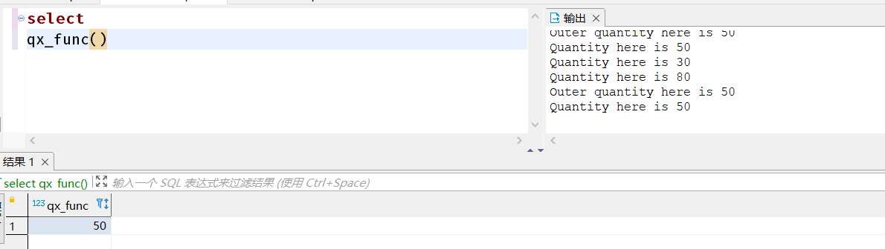
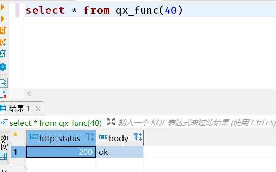
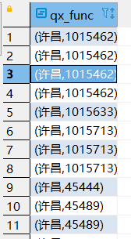
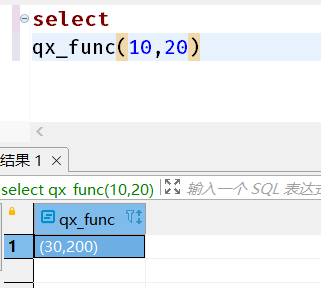
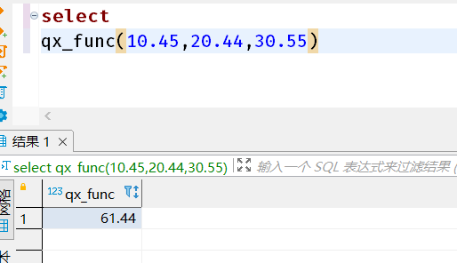
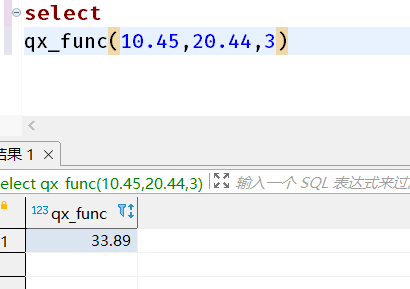
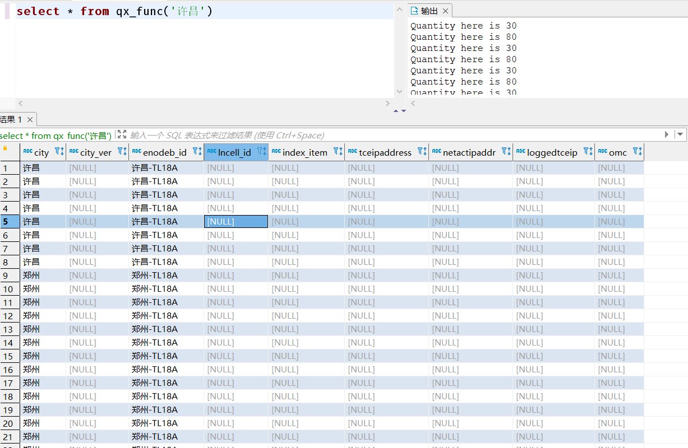
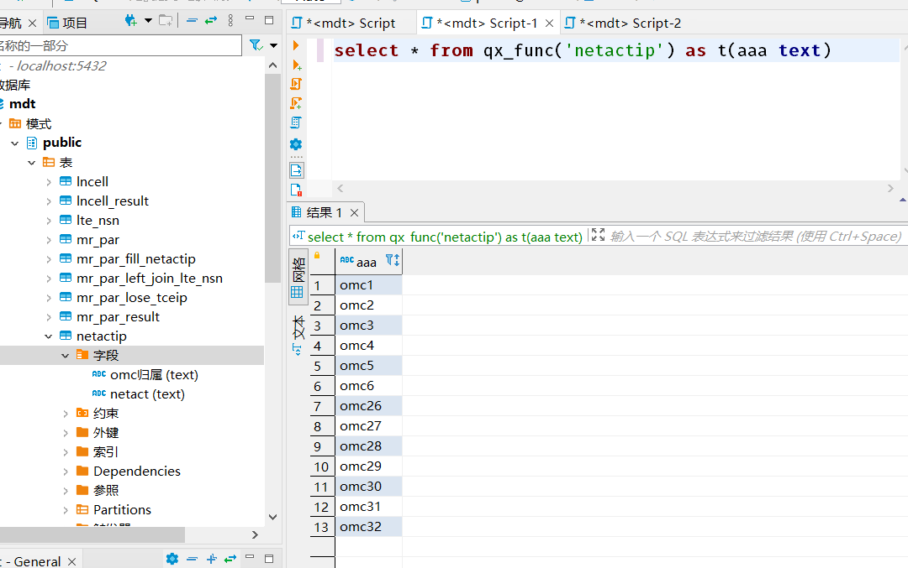

# PostgreSQL存储过程
## 块儿结构，内部块儿可以引用外部块儿变量
```sql
create or replace function qx_func() returns integer as $$
<< outerblock >>
declare
    quantity integer = 30;
begin

    raise notice 'Quantity here is %', quantity;
    quantity = 50;

    declare
        quantity integer = 80;
    begin
        raise notice 'Quantity here is %', quantity;
        raise notice 'Outer quantity here is %', outerblock.quantity;
    end;

        raise notice 'Quantity here is %', quantity;

    return quantity;
end;
$$ language plpgsql;
```
示例：

## 返回组合数据类型
```sql
create type http_result as (
    http_status int,
    body varchar
);
create or replace function qx_func(param int) returns http_result as $$
    declare
        code int;
        msg varchar;
    begin
        if param < 100 then
            code = 200;
            msg = 'ok';
        else
            code = 500;
            msg = 'fail';
        end if;
        return (code, msg);
    end;
$$ language plpgsql;
     
```
举例：



## return table
```sql
drop function if exists qx_func;
create function qx_func(city_p text) returns table(city text,enodeb_id text) as $$
begin 
	return query select s.city, s.enodeb_id from mr_par_lose_tceip s
					where s.city = city_p;
end;
$$ language plpgsql;
```
注意事项：from表名后面必须要加一个别名，select字段要用别名.***查询。
返回结果：


## 返回多个值时，用输出参数
```sql
drop function if exists qx_func;
create function qx_func(x int, y int, OUT sum int, OUT prod int) as $$
begin 
	 sum := x + y;
    prod := x * y;
end;
$$ language plpgsql;
```

返回结果：


## 生命变量或返回值为多态
```sql
drop function if exists qx_func;
create function qx_func(v1 anyelement, v2 anyelement, v3 anyelement, out sum_p anyelement) as $$
begin 
	 sum_p := v1 + v2 + v3;

end;
$$ language plpgsql;
```
注意事项：虽然参数为多态，但三个参数的数据类型必须一致（都为int或都为double）
返回结果：

使用anycompatible类型系列声明多态函数可能更有用，以便将输入参数自动提升为公共类型
```sql
drop function if exists qx_func;
create function qx_func(v1 anycompatible, v2 anycompatible, v3 anycompatible, out sum_p anycompatible) as $$
begin 
	 sum_p := v1 + v2 + v3;

end;
$$ language plpgsql;
```
这样的话 三个参数可以类型不同了。
举例：


## 复制类型
%TYPE提供了一个变量或表列的数据类型。你可以用它来声明将保持数据库值的变量。例如，如果你在users中有一个名为user_id的列。要定义一个与users.user_id具有相同数据类型的变量：
```sql
user_id users.user_id%TYPE;
```
通过使用%TYPE，你不需要知道你要引用的结构的实际数据类型，而且最重要地，如果被引用项的数据类型在未来被改变（例如你把user_id的类型从integer改为real），你不需要改变你的函数定义。

%TYPE在多态函数中特别有价值，因为内部变量所需的数据类型能在两次调用时改变。可以把%TYPE应用在函数的参数或结果占位符上来创建合适的变量。


## 行类型
```sql
create or replace function qx_func(city text) returns setof mr_par_lose_tceip as $$
    declare
       r mr_par_lose_tceip%rowtype; 
    begin
        for r.city,r.enodeb_id in select * from mr_par_lose_tceip loop
        return next r;
        end loop;
        return; 
    end;
$$ language plpgsql;
```

```sql
drop function qx_func;
create or replace function qx_func(city_p text) returns setof mr_par_lose_tceip as $$
--    declare
--       r mr_par_lose_tceip%rowtype; 
    begin
        return query select * from mr_par_lose_tceip;
        if not found then 
            raise exception '未找到数据';
        end if; 
        return; 
    end;
$$ language plpgsql;
```
声明函数时，使用 returns setof
返回时使用return next或者return query
举例：


## 记录数据类型
```sql
create or replace function qx_func(table_name varchar) returns setof record as $$
    declare
       r record; 
    begin
        for r in execute 'select omc归属 from ' || table_name loop
            return next r; 
        end loop; 
        return; 
    end;
$$ language plpgsql;
```

```sql
create or replace function qx_func(table_name varchar) returns setof record as $$
    declare
    begin
        return query execute 'select omc归属 from ' || table_name;
        if not found then
            raise exception '未找到数据';
        end if;
        return; 
    end;
$$ language plpgsql;
```
示例：
